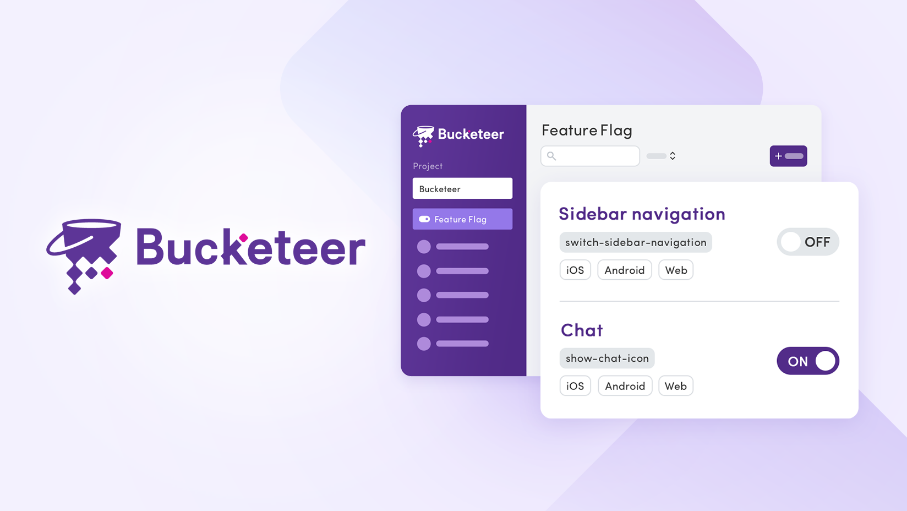
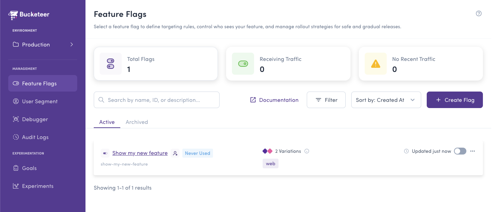

<h1 align="center">Enterprise-Grade Feature Management & Experimentation Platform</h1>
<h3 align="center">Self-Hosted. Scalable. Production-Ready.</h3>



<div id="header" align="center">
  <br/>
  <div id="links">
    <a href="https://bucketeer.io">
      Official Web Site
    </a>
    |
    <a href="https://docs.bucketeer.io">
      Documentation
    </a>
    |
    <a href="https://app.slack.com/client/T08PSQ7BQ/C043026BME1">
      Community (Slack)
    </a>
  </div>
</div>

## Try now

Try Bucketeer online with our [online demo](https://app.bucketeer.io/demo).



## Why Bucketeer?

[Bucketeer](https://bucketeer.io) is an open-source feature management and experimentation platform created by CyberAgent that combines enterprise-grade capabilities with the flexibility of self-hosting. Unlike expensive SaaS solutions, Bucketeer gives you complete control over your feature flag infrastructure while delivering advanced automation, sophisticated A/B testing, and a polished user experience.

**Scale from startup to enterprise:** Start with Docker and scale to 100M+ users per month with Kubernetes. Battle-tested in production at scale.

**Advanced features, zero licensing costs:** Get progressive rollouts, Bayesian experimentation, automated operations, and comprehensive audit logging—all features typically locked behind expensive enterprise tiers.

**Unique capabilities others don't have:** Flag-based targeting rules (use one flag's result as a condition for another) and split audience rollouts (nested experiments like 50/50 tests on 5% of traffic) set Bucketeer apart from all alternatives.

**Superior A/B testing:** Bayesian statistical analysis delivers faster, more accurate results with smaller sample sizes compared to traditional frequentist approaches.

**Modern, intuitive UI/UX:** A thoughtfully designed interface that makes complex feature management accessible to both technical and non-technical team members.

## Core Capabilities

### 🚀 Advanced Feature Flag Management

Control feature releases with precision through a comprehensive suite of tools designed for modern software teams.

- **Targeted Rollouts:** Release features to specific users based on attributes, segments, or custom rules
- **Progressive Rollouts:** Automate gradual feature releases with customizable schedules (hourly, daily, weekly)
- **Split Audience Rollouts:** Run nested experiments—e.g., 50/50 A/B test on just 5% of traffic for ultimate control
- **User Segmentation:** Create reusable user segments with rule-based targeting and bulk user upload
- **Flag-based Targeting Rules:** Use one flag's evaluation result as a targeting condition for another flag—a unique capability for sophisticated user targeting
- **Flag Prerequisites:** Define hard dependencies between flags to control evaluation order and ensure required conditions
- **Multi-Environment Support:** Manage feature flags across unlimited environments with full project isolation

<details>
<summary><b>🎯 Advanced Targeting: Flag Rules vs Prerequisites</b></summary>

**Flag as Rule Condition** lets you target users based on another flag's evaluation result. Example: *"Show premium feature (Flag A) to users who got variation 'new-design' from Flag B."* This creates dynamic, cross-flag targeting logic.

**Prerequisites** enforce hard dependencies before evaluation. Example: *"Don't evaluate Flag A unless Flag B returns variation X."* If the prerequisite isn't met, Flag A returns its OFF variation immediately.

These complementary features enable sophisticated multi-flag targeting strategies impossible with other platforms.
</details>

### 🧪 Bayesian A/B Testing & Experimentation

Make data-driven decisions faster with statistically superior experimentation.

- **Bayesian Statistical Analysis:** Get reliable results with smaller sample sizes and shorter experiment duration
- **Goal Tracking:** Define and measure custom conversion goals to evaluate feature impact
- **Multivariate Testing:** Test multiple variations simultaneously to find optimal solutions
- **Real-time Results:** Monitor experiment performance with live statistical significance calculations
- **Experiment Lifecycle Management:** Seamlessly transition from experiment to full rollout

### ⚙️ Intelligent Automation

Reduce manual work and respond to issues instantly with built-in automation.

- **Auto Operations:** Schedule flag changes, trigger actions based on event rates, or create custom automation rules
- **Progressive Rollout Templates:** Pre-configured rollout patterns for common release strategies
- **Flag Triggers:** Webhook-based flag control for CI/CD pipelines and APM integration (Datadog, New Relic, Dynatrace, etc.)
- **Event-Driven Actions:** Automatically disable flags when error thresholds are exceeded
- **Multi-Schedule Support:** Chain multiple scheduled operations for complex release workflows

### 🔐 Enterprise Security & Compliance

Maintain control and meet compliance requirements with comprehensive governance features.

- **Role-Based Access Control:** Granular permissions with Viewer, Editor, and Owner roles per environment
- **Complete Audit Logging:** Track every change with detailed history including who, what, when, and why
- **API Key Management:** Secure SDK authentication with separate keys for client, server, and public API access
- **Environment Isolation:** Full data separation between environments and projects
- **Admin & Environment Accounts:** Flexible account structure for organizations of any size

### 🔔 Integrations & Notifications

Stay informed and integrate with your existing tools seamlessly.

- **Slack Notifications:** Real-time alerts for flag changes, experiment results, and system events
- **Flag Lifecycle Alerts:** Automatic Slack notifications for unused flags (7+ days inactive) to maintain clean codebase and improve latency
- **Webhook Triggers:** Integrate with monitoring tools, CI/CD pipelines, and custom automation
- **RESTful API:** Comprehensive HTTP API for programmatic flag management (Read/Write/Admin access levels)
- **Push Notifications:** Firebase Cloud Messaging support for instant SDK updates

### 📊 Observability & Analytics

Understand how features are being used and make informed decisions.

- **Code References:** Automatically detect where flags are used in your codebase to maintain clean flag lifecycle
- **Feature Usage Tracking:** Monitor which features are actively used and by whom
- **Stale Flag Detection:** Automatic alerts for flags with no requests for 7+ days to prevent technical debt
- **Evaluation Metrics:** Track flag evaluation performance and cache hit rates
- **Goal Event Analytics:** Measure conversion rates and goal completions
- **Audit Trail:** Complete visibility into all system changes for debugging and compliance

### 🎯 Developer Experience

Built by developers, for developers—with the tools you need for modern development practices.

- **AI-Powered Workflows:** Model Context Protocol (MCP) servers for [managing flags](https://github.com/bucketeer-io/bucketeer-mcp) and [querying documentation](https://github.com/bucketeer-io/bucketeer-docs-local-mcp-server) via AI assistants (Claude, ChatGPT, etc.)
- **Code References:** Track where flags are used in your source code to safely remove obsolete flags and prevent technical debt
- **Interactive Debugger:** Test flag evaluations for specific users without deploying—supports batch testing multiple users and flags simultaneously
- **Trunk-Based Development:** Merge frequently without fear using feature flags to hide incomplete work
- **Local & Remote Evaluation:** Server SDKs support both evaluation modes for optimal performance
- **OpenFeature Compatible:** Use Bucketeer with the vendor-neutral OpenFeature standard
- **Hot Reload:** SDK updates without application restarts via push notifications
- **Type-Safe SDKs:** Well-designed SDKs with comprehensive documentation

## Supported SDKs

Bucketeer provides official SDKs for all major platforms and languages, plus OpenFeature support for maximum flexibility.

### Client-Side SDKs
Evaluate features on the server, perfect for mobile and browser applications:
- **Android** - Kotlin/Java support
- **iOS** - Swift support with CocoaPods
- **JavaScript** - Vanilla JS for web applications
- **Flutter** - Cross-platform mobile development
- **React** - Modern React applications
- **React Native** - Native mobile apps with React

### Server-Side SDKs
Evaluate features locally or remotely for optimal performance:
- **Go** - High-performance server-side evaluation
- **Node.js** - JavaScript/TypeScript server applications

### OpenFeature SDKs
Use Bucketeer with the vendor-neutral [OpenFeature](https://openfeature.dev) standard:
- **JavaScript/TypeScript**
- **Swift**
- **Kotlin**
- **Go**

[View all OpenFeature integrations →](https://openfeature.dev/ecosystem?instant_search%5BrefinementList%5D%5Bvendor%5D%5B0%5D=Bucketeer)

## Deployment Options

Bucketeer adapts to your infrastructure needs—start small and scale as you grow.

### Quick Start with Docker Compose (Lite Version)
Perfect for local development, small teams, or proof-of-concept deployments:
```bash
docker-compose up -d
```
Get started in minutes with a fully functional Bucketeer instance. The lite version uses MySQL and Redis—minimal infrastructure, maximum value. PostgreSQL support coming soon.

### Production (Kubernetes + Helm)
Enterprise-grade deployment for production workloads:
- **Proven at scale:** Handles 100M+ user evaluations per month
- **High availability:** Multi-instance deployment with automatic failover
- **Microservices architecture:** Independent scaling of API, batch, and subscriber services
- **Cloud-native:** Runs on any Kubernetes cluster (GKE, EKS, AKS, on-premise)
- **Infrastructure as Code:** Helm charts for reproducible deployments

### Architecture Highlights
- **Event-driven pipeline:** Efficient processing of evaluation and goal events via Pub/Sub
- **Redis caching:** Multi-layer caching with Redis for sub-millisecond flag evaluation responses
- **Flexible data storage:** MySQL support (PostgreSQL coming soon)
- **Envoy proxy:** Circuit breaking and fault tolerance built-in
- **Horizontal scaling:** Scale any component independently based on load

## Documentation

See our comprehensive [documentation](https://docs.bucketeer.io) for:
- Quick start guides
- SDK integration tutorials
- Feature flag best practices
- API reference
- Architecture deep-dives
- Deployment guides

## Why Choose Self-Hosted?

### Full Control & Ownership
- **Data sovereignty:** Your data never leaves your infrastructure
- **No vendor lock-in:** Complete control over upgrades and customizations
- **Compliance friendly:** Meet regulatory requirements for data residency
- **Custom modifications:** Extend Bucketeer to fit your specific needs

### Predictable Costs
- **No per-seat pricing:** Unlimited team members
- **No usage limits:** No per-evaluation or per-MAU charges
- **Infrastructure costs only:** Pay only for the compute and storage you use
- **Enterprise features included:** All features available out of the box

### Performance & Reliability
- **Deploy anywhere:** On-premise, cloud, or hybrid infrastructure
- **Low latency:** Deploy close to your users for optimal performance
- **High availability:** Design your own redundancy and failover strategy
- **Battle-tested:** Running in production at CyberAgent and growing community

## Get Started

### Try the Demo
Experience Bucketeer without any setup: [Online Demo](https://app.bucketeer.io/demo)

### Local Installation
```bash
git clone https://github.com/bucketeer-io/bucketeer.git
cd bucketeer
make docker-compose-up
```

This will start all services including MySQL, Redis, and the Bucketeer platform.

**Important:** Add the following to your `/etc/hosts` file to access the dashboard:
```
127.0.0.1 web-gateway.bucketeer.io
127.0.0.1 api-gateway.bucketeer.io
```

Then access the admin dashboard at `https://web-gateway.bucketeer.io`.

For detailed deployment instructions, configuration options, and production setup, see [Docker Compose Deployment](DEPLOYMENT.md#docker-compose-deployment).

### Kubernetes Deployment
For production deployments with high availability and scalability:
```bash
helm install bucketeer ./manifests/bucketeer -n bucketeer \
  --values ./manifests/bucketeer/values.prod.yaml
```

See the [Kubernetes deployment guide](DEPLOYMENT.md#kubernetes-deployment) for complete setup instructions.

## License

Apache License 2.0, see [LICENSE](https://github.com/bucketeer-io/bucketeer/blob/master/LICENSE).

## Contributing

We would ❤️ for you to contribute to Bucketeer and help improve it! Anyone can use and enjoy it!

Please follow our contribution guide [here](https://docs.bucketeer.io/contribution-guide/contributing).

### Our Amazing Contributors

Big thanks to all Bucketeer contributors who have helped us since the beginning!

<a href="https://github.com/cre8ivejp"></a>
<a href="https://github.com/hvn2k1"></a>
<a href="https://github.com/nnnkkk7"></a>
<a href="https://github.com/t-kikuc"></a>
<a href="https://github.com/Ubisoft-potato"></a>
<a href="https://github.com/duyhungtnn"></a>
<a href="https://github.com/kakcy"></a>
<a href="https://github.com/bimalgrg519"></a>
<a href="https://github.com/kentakozuka"></a>

<a href="https://github.com/masaaania"></a>
<a href="https://github.com/ono-max"></a>
<a href="https://github.com/gkuga"></a>
<a href="https://github.com/mura-s"></a>
<a href="https://github.com/asukaleido"></a>
<a href="https://github.com/anjuinaba"></a>
<a href="https://github.com/sabazusi"></a>
<a href="https://github.com/nghialv"></a>
<a href="https://github.com/codesuki"></a>

<a href="https://github.com/satoshi0212"></a>
<a href="https://github.com/takahirom"></a>
<a href="https://github.com/hiro511"></a>
<a href="https://github.com/rinov"></a>
<a href="https://github.com/sckm"></a>
<a href="https://github.com/inamiy"></a>
<a href="https://github.com/dekatotoro"></a>
<a href="https://github.com/Nonchalant"></a>
<a href="https://github.com/YukiMatsumura"></a>

<a href="https://github.com/yysskk"></a>
<a href="https://github.com/xenbase"></a>
<a href="https://github.com/unvalley"></a>
