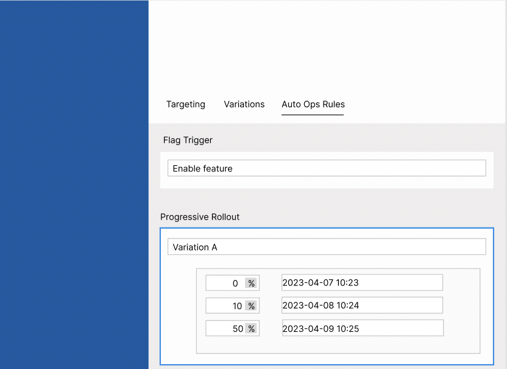
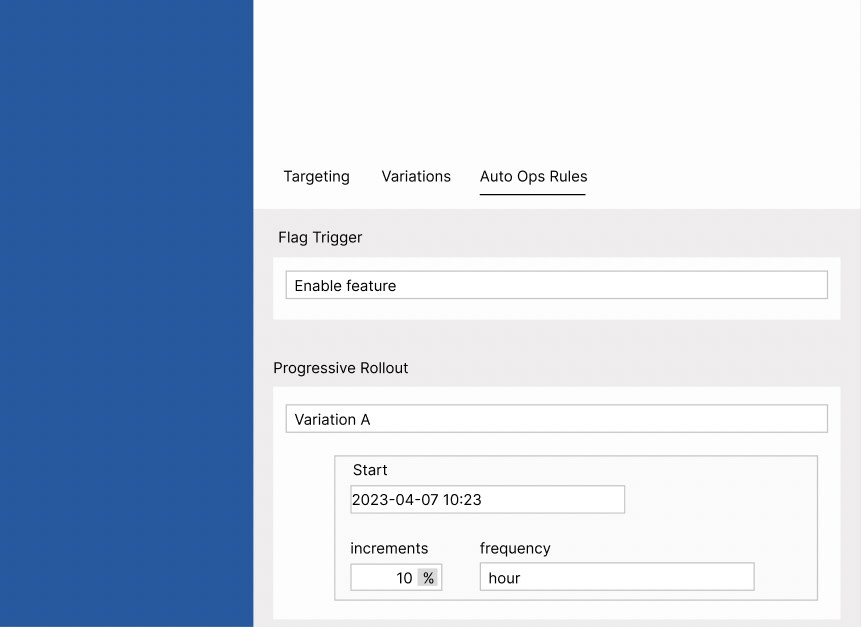
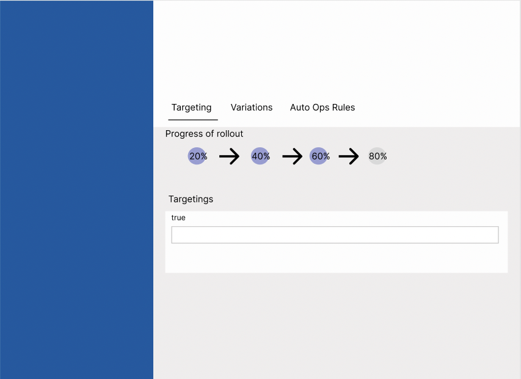
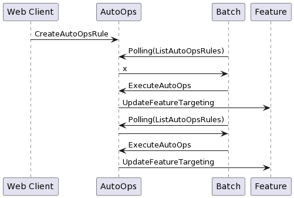

# Summary

# UI

We'll introduce two kinds of UI, "Manual Setting" and "Template Setting".

## Manual Setting

Users can determine any percentage and schedule in this UI.



## Template Setting

Manual Setting has a lot of flexibility, but it’s hard when configuring a periodic increase in the percentage of a variation.
In this case, Template Setting is useful.



## Progress bar of rollout



# Important Notice

* Users can use Progressive Rollout when the number of variations is less than or equal to 2
* Users can't use same scheduled time in single auto ops rules. For example, users can not set true for 50% at 2023-01-01 00:06:00 and 80% at the same time.
* The interval of time for each scheduled time must be at least 5 minutes.

# Processing flow

The following image is a processing flow in this feature.



For instance, Web Client sends clause as follows:

```go
&autoopsproto.ProgressiveRolloutClause{
	// The another varition id is vid-2
	VariationId: "vid-1",
	Schedules: []*autoopsproto.ProgressiveRolloutScheduleClause_Schedule{
		{
			// '2023-01-01 00:03:00'
			Time: 1672498980,
			Weight: 20000,
		},
		{
			// '2023-01-01 00:06:00'
			Time: 1672499160,
			Weight: 40000,
		},
		{
			// '2023-01-01 00:09:00'
			Time: 1672499340,
			Weight: 60000,
		},
	},
}
```

1. Web Client registers the above clauses by calling `CreateProgressiveRollout` rules
2. Batch service calls `ListProgressiveRollout`, and check if the current time is a scheduled time. In this case, it checks whether the current time is 2023-01-01 00:03:00.
3. If the current time is a scheduled time, Batch service call `ExecuteProgressiveRollout`.
4. AutoOps service calls `UpdateFeatureTargeting` to update feature rules. In this case, update the weight of vid-1 to 20000 and the weight of vid-2 to 80000.

# Changes

## Table

We'll create `progressive_rollout` table as follows. The `clause` always can be converted into `ProgressiveRolloutScheduleClause`.

```sql
CREATE TABLE IF NOT EXISTS `progressive_rollout` (
  `id` VARCHAR(255) NOT NULL,
  `feature_id` VARCHAR(255) NOT NULL,
  `clause` JSON NOT NULL,
  `status` INT(11) NOT NULL,
  `type` INT(11) NOT NULL,
  `created_at` BIGINT(20) NOT NULL,
  `updated_at` BIGINT(20) NOT NULL,
  `environment_namespace` VARCHAR(255) NOT NULL,
  PRIMARY KEY (`id`, `environment_namespace`),
  CONSTRAINT `foreign_progressive_rollout_feature_id_environment_namespace`
    FOREIGN KEY (`feature_id`, `environment_namespace`)
    REFERENCES `feature` (`id`, `environment_namespace`)
    ON DELETE NO ACTION
    ON UPDATE NO ACTION
);
```

## Proto

### Progressive rollout

* proto/autoops/progressive_rollout.proto

`Status` represents the state of operations for ProgressiveRollout. If a operation has not started, `Status` is WAITING.
If a operation is in progress, `Status` is DOING. If a operaiton is finished, `Status` is DONE.
All fields in `ProgressiveRollout` are stored to DB as columns.
The reason of using `google.protobuf.Any` is for ease of expansion.

```proto
message ProgressiveRollout {
  enum Status {
    WAITING = 0;
    DOING = 1;
    DONE = 2;
  }
  enum Type {
    MANUAL_SCHEDULE = 0;
    AUTOMATIC_SCHEDULE = 1;
  }
  string id = 1;
  string feature_id = 2;
  google.protobuf.Any clause = 3;
  Status status = 4;
  Type type = 5;
  int64 created_at = 6;
  int64 updated_at = 7;
}
```

* proto/autoops/clause.proto

`ProgressiveRolloutManualScheduleClause` is set when Manual Setting is used by users.
`ProgressiveRolloutAutomaticScheduleClause` is set when Template Setting is used by users.

**NOTE**
When `ProgressiveRolloutAutomaticScheduleClause` will be converted into `ProgressiveRollout`,
We need to calculate `time` based on `started_at` and `interval`.

```proto
message ProgressiveRolloutScheduleClause {
  message Schedule {
    int64 time = 1;
    int32 weight = 2;
    bool triggered = 3;
  }
  string variation_id = 1;
  repeated Schedule schedules = 2;
}

message ProgressiveRolloutManualScheduleClause {
  string variation_id = 1;
  repeated ProgressiveRolloutScheduleClause.Schedule schedules = 2;
}

message ProgressiveRolloutAutomaticScheduleClause {
  enum Interval {
    UNKNOWN = 0;
    HOURLY = 1;
    DAILY = 2;
    WEEKLY = 3;
  }
  string variation_id = 1;
  int64 started_at = 2;
  Interval interval = 3;
  bool triggered = 4;
}
```

* proto/autoops/service.proto

Progressive Rollout feature has unique API for creating, updating and deleting.

```proto
message CreateProgressiveRolloutRequest {
  string environment_namespace = 1;
  CreateProgressiveRolloutCommand command = 2;
}

message CreateProgressiveRolloutResponse {}

message GetProgressiveRolloutRequest {
  string id = 1;
  string environment_namespace = 2;
}

message GetProgressiveRolloutResponse {
  ProgressiveRollout progressive_rollout = 1;
}

message UpdateProgressiveRolloutRequest {
  string id = 1;
  string environment_namespace = 2;
  ChangeProgressiveRolloutManualScheduleClauseCommand change_progressive_rollout_manual_schedule_clause_command = 3;
  ChangeProgressiveRolloutAutomaticScheduleClauseCommand change_progressive_rollout_automatic_schedule_clause_command = 4;
}

message UpdateProgressiveRolloutResponse {}

message DeleteProgressiveRolloutRequest {
  string id = 1;
  string environment_namespace = 2;
  DeleteProgressiveRolloutCommand command = 3;
}

message DeleteProgressiveRolloutResponse {}

message ListProgressiveRolloutRequest {
  enum OrderBy {
    DEFAULT = 0;
    CREATED_AT = 1;
    UPDATED_AT = 2;
  }
  enum OrderDirection {
    ASC = 0;
    DESC = 1;
  }
  string environment_namespace = 1;
  int64 page_size = 2;
  string cursor = 3;
  repeated string feature_ids = 4;
  OrderBy order_by = 5;
  OrderDirection order_direction = 6;
  google.protobuf.BoolValue is_waiting = 7;
  google.protobuf.BoolValue is_doing = 8;
  google.protobuf.BoolValue is_done = 9;
  string search_keyword = 10;
  google.protobuf.BoolValue is_manual_scheduling = 11;
  google.protobuf.BoolValue is_automatic_scheduling = 12;
}

message ListProgressiveRolloutResponse {
  repeated ProgressiveRollout progressive_rollouts = 1;
  string cursor = 2;
}
```

* proto/autoops/command.proto

```proto
message CreateProgressiveRolloutCommand {
  string feature_id = 1;
  ProgressiveRolloutManualScheduleClause progressive_rollout_manual_schedule_clause = 2;
  ProgressiveRolloutAutomaticScheduleClause progressive_rollout_automatic_schedule_clause = 3;
}

message DeleteProgressiveRolloutCommand {}

message AddProgressiveRolloutManualScheduleClauseCommand {
  ProgressiveRolloutManualScheduleClause clause = 1;
}

message ChangeProgressiveRolloutManualScheduleClauseCommand {
  string id = 1;
  ProgressiveRolloutManualScheduleClause clause = 2;
}

message DeleteProgressiveRolloutManualScheduleClauseCommand {}

message AddProgressiveRolloutAutomaticScheduleClauseCommand {
  ProgressiveRolloutAutomaticScheduleClause clause = 1;
}

message ChangeProgressiveRolloutAutomaticScheduleClauseCommand {
  string id = 1;
  ProgressiveRolloutAutomaticScheduleClause clause = 2;
}

message DeleteProgressiveRolloutAutomaticScheduleClauseCommand {}
```

## Backend Changes

### Major changes

* batch/job/progressive_rollout_watcher.go
    * This watcher updates feature rules at the scheduled time.
* batch/executor/rollout_updater.go
	* This is the executor which sends ChangeAutoOpsRuleExecutedCommand to AutoOpsRule service.
* storage/v2/progressive_rollout.go
	* This is for inserting data into `progressive_rollout` table.
* pkg/autoops/api/progressive_rollout.go
* pkg/autoops/command/progressive_rollout.go
* pkg/autoops/domain/progressive_rollout.go

### Minor changes

* pkg/opsevent/batch/executor/executor.go
	* Rename executor.go to flag_triggerer.go
	* Then abstract executor.go such as https://github.com/bucketeer-io/bucketeer/blob/main/pkg/eventpersisterdwh/persister/event.go.
* pkg/feature/api/feature.go
	* We need to modify `UpdateFeatureVariations`. We need to validate changing variations. Return error if Progressive Rollout is running.
