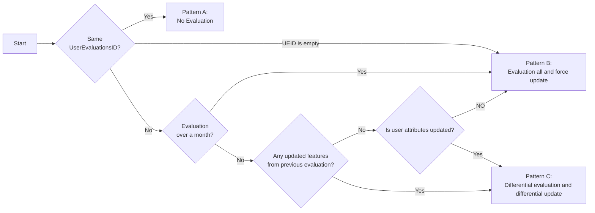
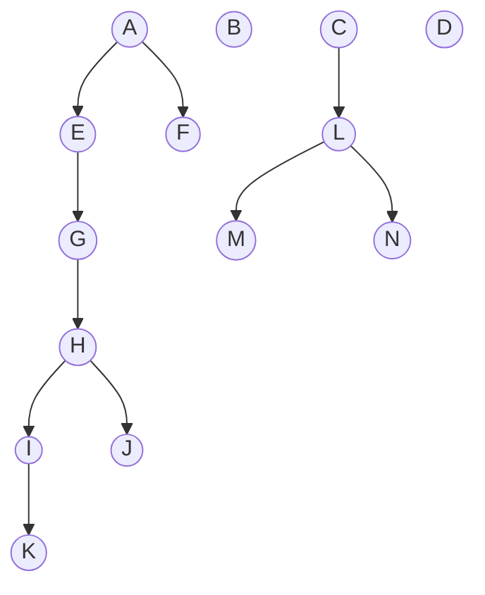

# Evaluation for updated Feature flags


## Proposal

- The primary purpose of this feature is to keep the GetEvaluations response size small.
- The existing implementation checks `UserEvaluationsID` and doesn't return evaluation results if it has not been updated.
  - `UserEvaluationsID` is a hash derived from the feature ID, feature version, and user attributes.
- The existing implementation evaluates all feature flags when the UserEvaluationsID is updated, but here we propose a method to target only those feature flags that need to be evaluated.
- Also, we can make the tag optional.
  - Previously, specifying a tag was required when executing GetEvaluations to reduce the response size.
  - But, with this proposal, the response size can be kept small, so specifying a tag can be made optional.

## Implementation

The SDK stores the `EvaluatedAt` value indicating the timestamp of the evaluation's execution.
When GetEvaluations is called again, that timestamp is sent to the server as a request parameter.

The server checks it against the updatedAt value of the feature flags and only evaluates those that have been updated since the previous evaluation.

As an exception, the following feature flags must be evaluated regardless of the timestamp value.
- Feature flags that depend on the feature flags that need to be evaluated
- (if user attributes have been updated) Feature flags with targeting rules

If user attributes have been updated, the evaluation result may also change.
Since the server has to know that update, the SDK sends the `UserAttributesUpdated` flag to the server as a request parameter like the timestamp.

In addition, the following changes are required in both the server and SDK implementations:
- Since only some feature flags may be evaluated and returned, the SDK implementation needs to be modified to allow differential updates of local data.
- The server must return information about archived feature flags to the SDK because its evaluation result is already stored locally.
  - The SDK must delete the evaluation result of archived features.
  - The server must put the archived feature flags to Redis.
- The validation of the request parameter `Tag` must be removed.

We need to modify the proto like the following.
```diff
  message GetEvaluationsRequest {  
    string tag = 1;  
    user.User user = 2;  
    string user_evaluations_id = 3;  
    string feature_id = 4 [deprecated = true]; // instead, use GetEvaluation API  
    bucketeer.event.client.SourceId source_id = 5;  
+   int64 evaluated_at = 6;  
+   bool is_user_attributes_updated = 7;  
  }
  
  message GetEvaluationsResponse {
    feature.UserEvaluations.State state = 1;
    feature.UserEvaluations evaluations = 2;
    string user_evaluations_id = 3;
  } 

  message UserEvaluations {
    enum State {
      QUEUED = 0;
      PARTIAL = 1;
      FULL = 2;
    }
    string id = 1;
    repeated Evaluation evaluations = 2;
    int64 created_at = 3;
+   repeated string archived_feature_ids = 4;
+   bool force_update = 5;    
  }
```

### Evaluation flow
The following diagram shows the flow to evaluate the feature flags:



#### Pattern A: No Evaluation
As in the existing implementation, the server checks `UserEvaluationID` and doesn't return evaluation results if it has not been updated.
In this case, the `Evaluations` field in the response is set to null because no evaluation has been performed.
An example response is shown below:

```json
{
  "Evaluations": null, 
  "UserEvaluationsID": "yyy"
}
```

#### Pattern B: Evaluation all and force update

All feature flags should be evaluated, and the data in the SDK should be updated in the following the case:

- Your last evaluation was done more than a month ago. It will be determined that the results are considered too old and must be overwritten.
- `UserEvaluationsID` in the GetEvaluationsRequest is empty. The SDK can set it to empty to re-evaluate and update all features when needed.
- `UserEvaluationsID` has changed even though the feature flags and user attributes have not been updated. It is considered unusual.
 
In this pattern, the server sets the `Evaluations` field evaluation results of all feature flags and sets the `ForceUpdate` field to true.

An example response is shown below:

```json
{
  "Evaluations": {
    "Id": "xxx",
    "CreatedAt": 1680274800,
    "Evaluations": [{"featureId": "featureA", ...}, {"featureId":  "featureB", ...}, ...],
    "ArchivedFeatures": [],
    "ForceUpdate": true,
  },
  "UserEvaluationsID": "yyy"
}
```

#### Pattern C: Differential evaluation and differential update

In this pattern, the server must identify which feature flags to be evaluated.
For more information about which feature flags should be evaluated, see [Which feature flags to evaluate](#which-feature-flags-to-evaluate).
Also, if any feature flags have been archived since the last evaluation, their IDs must be included in the `ArchivedFeatures` field in the response.
Thus, this pattern can be further classified into four sub-patterns as below:

|             | Evaluations  | ArchivedFeatures |
|-------------|--------------|------------------|
| Pattern C-1 | has elements | has elements     |
| Pattern C-2 | has elements | empty            |
| Pattern C-3 | empty        | has elements     |
| Pattern C-4 | empty        | empty            |


```json
// Pattern C-1
{
  "Evaluations": {
    "Id": "xxx",
    "CreatedAt": 1680274800,
    "Evaluations": [{"featureId": "featureA", ...}, {"featureId":  "featureB", ...}, ...],
    "ArchivedFeatures": ["featureX", "featureY"],
    "ForceUpdate": false,
  },
  "UserEvaluationsID": "yyy"
}

// Pattern C-2
{
  "Evaluations": {
    "Id": "xxx",
    "CreatedAt": 1680274800,
    "Evaluations": [{"featureId": "featureA", ...}, {"featureId":  "featureB", ...}, ...],
    "ArchivedFeatures": [],
    "ForceUpdate": false,
  },
  "UserEvaluationsID": "yyy"
}

// Pattern C-3
{
  "Evaluations": {
    "Id": "xxx",
    "CreatedAt": 1680274800,
    "Evaluations": [],
    "ArchivedFeatures": ["featureX", "featureY"],
    "ForceUpdate": false,
  },
  "UserEvaluationsID": "yyy"
}

// Pattern C-4
{
  "Evaluations": {
    "Id": "xxx",
    "CreatedAt": 1680274800,
    "Evaluations": [],
    "ArchivedFeatures": [],
    "ForceUpdate": false,
  },
  "UserEvaluationsID": "yyy"
}
```

### Which feature flags to evaluate
The following diagram shows the dependency relationship between multiple feature flags:




#### Pattern1
Assuming only featureA, featureB, featureC, and featureD were updated after the last evaluation.

Only featureA, featureB, featureC, and featureD are evaluated since no features depend on these features.

| updated                                | evaluated                               |
|----------------------------------------|-----------------------------------------|
| featureA, featureB, featureC, featureD | featureA, featureB, featureC, featureD  |


#### Pattern2
Assuming only featureF was updated after the last evaluation.

Since featureA specifies featureF as a Prerequisite, the evaluation of featureA may also change.

Therefore, the featureA also needs to be re-evaluated.

| updated  | evaluated          |
|----------|--------------------|
| featureF | featureA, featureF |

#### Pattern3
Assuming only featureE and featureK have targeting rules and user attributes are updated.

featureK is a part of the chain of dependencies, where the featureA depends on featureE, and featureE depends on featureG...

In this case, we must evaluate all feature flags involved in dependencies.

| with targeting rules | evaluated                                                  |
|----------------------|------------------------------------------------------------|
| featureE, featureK   | featureA, featureE, featureG, featureH, featureI, featureK |


### SDK

#### Timestamp of the evaluation's execution
When receiving the response, the SDK stores the `GetEvaluationsResponse.UserEvaluations.CreatedAt` locally as `EvaluatedAt`.
The saved timestamp will be included in the subsequent GetEvaluations request.

#### Storing the evaluation results in local storage
First, the SDK must check the `ForceUpdate` field in the response.
Then, if its value is true, the SDK inserts all evaluations in response to local storage after deleting the local data.
If the `ForceUpdate` is false, the SDK updates the evaluations in local data differently.
It will also return the evaluation results of archived feature flags.
The SDK must delete the local evaluation data of archived flags.

#### When the user attributes are updated
If the SDK updates the user attributes, you must set `UserAttributesUpdated` to true in GetEvaluationsRequest to notify the server.
You can get evaluation results of feature flags that have the target rule.

#### When the tag is changed
The existing implementation returns evaluation results of feature flags with the same tag as specified in the `tag` field in the GetEvaluationsRequest.
If the `tag` field is changed, you will get a completely different response from the last evaluation.
In this case, the SDK should set `UserEvaluationsID` to empty in order to delete old local data and get evaluation results of all features.
For more information, see [Pattern B: Evaluation all and force update](#pattern-b-evaluation-all-and-force-update).

## Release Steps

During implementation changes, we ensure that any version of the SDK will work properly.

1. Add a function to get the feature flag dependencies.
2. Change the feature module and feature-tag-cacher module.
   * Change the feature module's behavior to put feature flags to Redis in addition to MySQL in order to reduce time lag.
   * Change the feature module's behavior to put archived feature flags to Redis.(The server does not return archived flags to the SDK at this time.)
   * Remove the feature-tag-cacher module because it will have finished its role. 
3. Change the api-gateway module. 
   * Add the `EvaluatedAt` and `UserAttributesUpdated` fields to the GetEvaluationsRequest object.
   * Add implementation to check the timestamp `EvaluatedAt` against the feature flag's `UpdatedAt` field.
   * Add implementation to evaluate the features that have targeting rules when `UserAttributesUpdated` is true.
   * Add the `ArchivedFeatures` and `ForceUpdate` fields to the GetEvaluationsResponse object.
4. Modify each SDK to support `EvaluatedAt` and differential update the local data.
5. Make GetEvaluationsRequest's `UserEvaluationsID` field deprecated and the `Tag` field optional.

## What not to do

We do not detect which attributes have changed when user attributes are updated.
We can do it strictly, but it also makes the code more complex.
Given the number of feature flags with targeting rules, the impact is considered to be limited.
