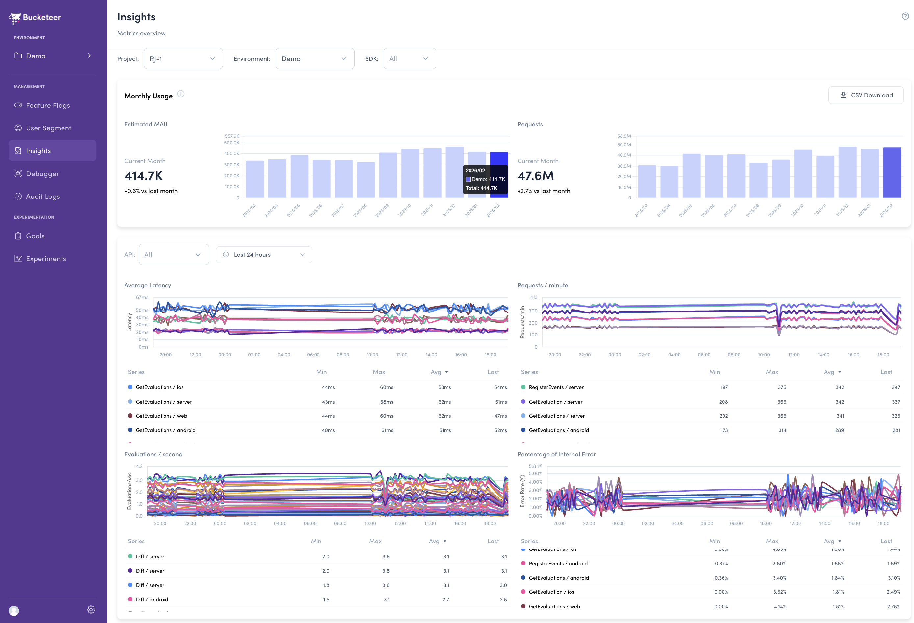
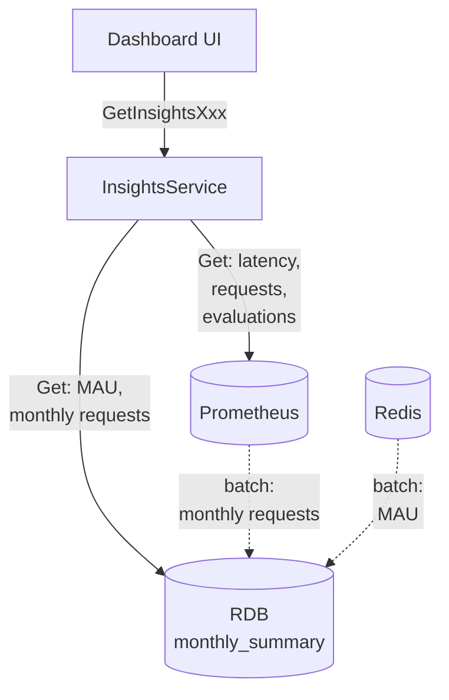
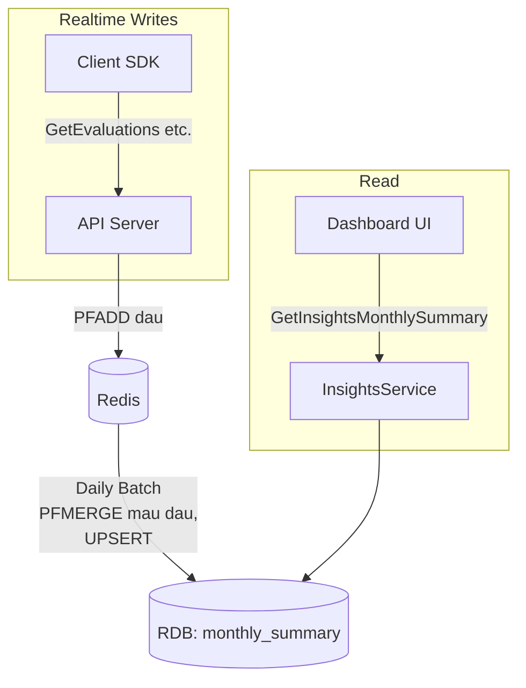

# Insights Dashboard

## Overview

Add a Dashboard page where users can view Bucketeer usage metrics (request count, MAU, SDK latency, etc.)

**Related Issue**: https://github.com/bucketeer-io/bucketeer/issues/2151

## UI



1. **MAU**: Current and historical estimated MAU
2. **Monthly Requests**: Current and historical total request count
3. Latency time series graph
4. Request count time series graph
5. Evaluations by type time series graph

### Filters:
- Common to all:
  - **Project**: All or select specific Project
  - **Environment**: All or select specific Environment
  - **SDK**: All or select specific SDK
- For 3, 4, 5 only:
  - **API**: All or select specific API
  - **Time Range**: Presets (1h, 6h, 24h, 7d, 30d, This Month) + Custom range (max 31 days)


## Architecture

### System Overview



### API

Instead of fetching all data with a single API, we split into 4 APIs per UI area for better read performance, extensibility, and fault isolation.

| API                         | UI Area             | Data Source |
| --------------------------- | ------------------- | ----------- |
| `GetInsightsMonthlySummary` | MAU, Total Requests | RDB         |
| `GetInsightsLatency`        | Latency             | Prometheus  |
| `GetInsightsRequests`       | Request Count       | Prometheus  |
| `GetInsightsEvaluations`    | Evaluations         | Prometheus  |


### Data Sources

We use a combination of Prometheus, Redis, and RDB.

Reasons:
- Using Prometheus data directly is simple and flexible
- Redis HyperLogLog is efficient for counting unique users
- RDB is used to persist historical data beyond Redis TTL

Usage:

| Data Source | Purpose                                  |
| ----------- | ---------------------------------------- |
| Prometheus  | Request count, Latency, Evaluation types |
| Redis       | MAU calculation                          |
| RDB         | Historical MAU, Request count            |

### Persisting Monthly Data

MAU and request count are persisted to RDB via daily batch to display 1+ years of historical monthly data.

By running daily, current month data is also available (up to previous day).

### MAU Processing Flow



#### Redis Keys

| Key Pattern                         | Data Type   | Purpose                      | TTL     |
| ----------------------------------- | ----------- | ---------------------------- | ------- |
| `{envId}:{sourceId}:dau:{yyyyMMdd}` | HyperLogLog | Daily DAU                    | 60 days |
| `{envId}:{sourceId}:mau:{yyyyMM}`   | HyperLogLog | Monthly MAU (PFMERGE result) | 60 days |


#### Processing Flow

| Timing       | Process                         | Command                                                                          |
| ------------ | ------------------------------- | -------------------------------------------------------------------------------- |
| Realtime     | Add user ID to DAU              | `PFADD {envId}:{sourceId}:dau:{yyyyMMdd} {user_id}`                              |
| Daily (0:00) | Merge previous day's DAU to MAU | `PFMERGE {envId}:{sourceId}:mau:{yyyyMM} {envId}:{sourceId}:dau:{yyyyMMdd}`      |
| Daily (0:00) | UPSERT MAU to RDB               | 1. `PFCOUNT {envId}:{sourceId}:mau:{yyyyMM}`<br>2. `UPSERT INTO monthly_summary` |


## Details

### Proto

To ensure extensibility for future graph additions, Latency/Requests/Evaluations share common message types.

`proto/insights/service.proto`:


```protobuf
// =====================================
// 1. Monthly Usage API
// =====================================

message GetInsightsMonthlySummaryRequest {
  repeated string environment_ids = 1;
  repeated bucketeer.event.client.SourceId source_ids = 2;
}

message GetInsightsMonthlySummaryResponse {
  repeated MonthlySummarySeries mau_series = 1;
  repeated MonthlySummarySeries requests_series = 2;
}

message MonthlySummarySeries {
  string environment_id = 1;
  bucketeer.event.client.SourceId source_id = 2;
  repeated MonthlySummaryDataPoint data = 3;  // Sorted by yearmonth ascending
}

message MonthlySummaryDataPoint {
  string yearmonth = 1;  // "202601"
  double value = 2;
}

// =====================================
// 2. Time Series APIs (Common for Latency, Requests, Evaluations)
// =====================================

message GetInsightsTimeSeriesRequest {
  repeated string environment_ids = 1;
  repeated bucketeer.event.client.SourceId source_ids = 2;
  repeated bucketeer.event.client.ApiId api_ids = 3;
  int64 start_at = 4; // Unix timestamp in seconds
  int64 end_at = 5;   // Unix timestamp in seconds
}

message GetInsightsTimeSeriesResponse {
  repeated InsightsTimeSeries timeseries = 1;
}

message InsightsTimeSeries {
  string environment_id = 1;
  bucketeer.event.client.SourceId source_id = 2;
  bucketeer.event.client.ApiId api_id = 3;
  repeated InsightsDataPoint data = 4;  // Sorted by timestamp ascending
}

message InsightsDataPoint {
  int64 timestamp = 1;  // Unix timestamp in seconds
  double value = 2;
}

// =====================================
// Service
// =====================================

service InsightsService {
  rpc GetInsightsMonthlySummary(GetInsightsMonthlySummaryRequest) returns (GetInsightsMonthlySummaryResponse);
  rpc GetInsightsLatency(InsightsTimeSeriesRequest) returns (InsightsTimeSeriesResponse);
  rpc GetInsightsRequests(InsightsTimeSeriesRequest) returns (InsightsTimeSeriesResponse);
  rpc GetInsightsEvaluations(InsightsTimeSeriesRequest) returns (InsightsTimeSeriesResponse);
}
```

### RDB

**Table**: `monthly_summary` (new)

```sql
CREATE TABLE `monthly_summary` (
  `environment_id` varchar(255) NOT NULL,
  `source_id` int NOT NULL,
  `yearmonth` varchar(6) NOT NULL,       -- YYYYMM
  `mau` bigint NOT NULL DEFAULT 0,
  `request_count` bigint NOT NULL DEFAULT 0,
  `created_at` bigint NOT NULL,
  `updated_at` bigint NOT NULL,
  PRIMARY KEY (`environment_id`, `source_id`, `yearmonth`)
) CHARSET utf8mb4 COLLATE utf8mb4_bin;
```

`mau` and `request_count` will be updated by daily batch.

### Prometheus Metrics

Add the following 3 metrics:
- Latency: `bucketeer_grpc_detail_server_handling_seconds`
- Request count: `bucketeer_grpc_detail_server_handled_total`
- Evaluation types: `bucketeer_grpc_detail_evaluations_total`

Background: The following metrics currently exist but cannot be filtered by Project/Environment/SDK:

- Latency: `bucketeer_grpc_server_handling_seconds`
- Request count: `bucketeer_grpc_server_handled_total`
- Evaluation types: `bucketeer_api_gateway_evaluations_total`

## Tasks

- Data Generation:
  - Add Prometheus Metrics
  - Add Redis PFADD processing to Backend (DAU counting)
- Daily Batch:
  - RDB: Create table
  - MAU: PFMERGE, PFCOUNT, UPSERT
  - Requests: UPSERT
- Backend:
  - Add proto definitions
  - Implement APIs (query from each data source and build response)
- Frontend: UI implementation
