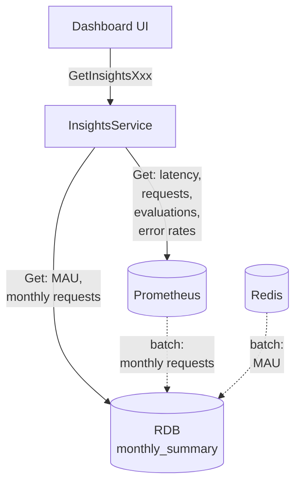
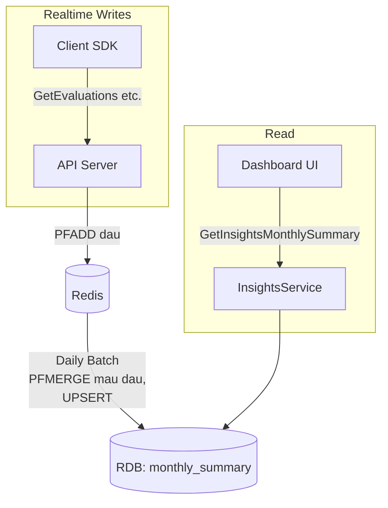

# Insights Dashboard

## Overview

Add a Dashboard page where users can view Bucketeer usage metrics (request count, MAU, SDK latency, etc.)

**Related Issue**: https://github.com/bucketeer-io/bucketeer/issues/2151

## UI


1. **MAU**: Current and historical estimated MAU
2. **Monthly Requests**: Current and historical total request count
3. Latency time series graph
4. Request count time series graph
5. Evaluations by type time series graph
6. Error rates time series graph

1~4 are based on the API gateway metrics, not SDK.

### Filters:
- Common to all:
  - **Project**: All or select specific Project
  - **Environment**: All or select specific Environment
  - **SDK**: All or select specific SDK
- For 3, 4, 5 only:
  - **API**: All or select specific API
  - **Time Range**: Presets (1h, 6h, 24h, 7d, 30d, This Month) + Custom range (max 31 days)

### CSV Export
- A button to download MAU / Monthly Requests for the past 12 months filtered by currently selected Project/Environment/SDK

```csv
yearmonth,project_name,environment_name,sdk,mau,request_count
202601,Project-A,Production,JAVASCRIPT,12345,9876543
202601,Project-A,Production,IOS,8901,1234567
...
```


## Architecture

### System Overview



### API

Instead of fetching all data with a single API, we split into 5 APIs per UI area for better read performance, extensibility, and fault isolation.

| API                         | UI Area             | Data Source |
| --------------------------- | ------------------- | ----------- |
| `GetInsightsMonthlySummary` | MAU, Total Requests | RDB         |
| `GetInsightsLatency`        | Latency             | Prometheus  |
| `GetInsightsRequests`       | Request Count       | Prometheus  |
| `GetInsightsEvaluations`    | Evaluations         | Prometheus  |
| `GetInsightsErrorRates`     | Error Rates         | Prometheus  |

### Data Sources

We use a combination of Prometheus, Redis, and RDB.

Reasons:
- Using Prometheus data directly is simple and flexible
- Redis HyperLogLog is efficient for counting unique users
- RDB is used to persist historical data beyond Redis TTL

Usage:

| Data Source | Purpose                                               |
| ----------- | ----------------------------------------------------- |
| Prometheus  | Request count, Latency, Evaluation types, Error rates |
| Redis       | MAU calculation                                       |
| RDB         | Historical MAU, Request count                         |

### Persisting Monthly Data

MAU and request count are persisted to RDB via daily batch to display 1+ years of historical monthly data.

By running daily, current month data is also available (up to previous day).

### MAU Processing Flow



#### Redis Keys

| Key Pattern                      | Data Type   | Purpose                      |
| -------------------------------- | ----------- | ---------------------------- |
| `{envId:sourceId:au}:d:yyyyMMdd` | HyperLogLog | Daily DAU                    |
| `{envId:sourceId:au}:m:yyyyMM`   | HyperLogLog | Monthly MAU (PFMERGE result) |

Using the hash tag `{envId:sourceId:au}` to ensure that multiple keys are allocated in the same hash slot.
See https://redis.io/topics/cluster-spec#keys-hash-tags.


#### Processing Flow

| Timing       | Process                         | Command                                                                                       |
| ------------ | ------------------------------- | --------------------------------------------------------------------------------------------- |
| Realtime     | Add user ID to DAU              | `PFADD {envId:sourceId:au}:d:yyyyMMdd {user_id}`                                             |
| Daily (0:00) | Merge previous day's DAU to MAU | `PFMERGE {envId:sourceId:au}:m:yyyyMM {envId:sourceId:au}:d:yyyyMMdd`                        |
| Daily (0:00) | UPSERT MAU to RDB               | 1. `PFCOUNT {envId:sourceId:au}:m:yyyyMM`<br>2. `UPSERT INTO monthly_summary`                |


## Details

### RDB

**Table**: `monthly_summary` (new)

```sql
CREATE TABLE `monthly_summary` (
  `environment_id` varchar(255) NOT NULL,
  `source_id` varchar(30) NOT NULL,
  `yearmonth` varchar(6) NOT NULL,       -- YYYYMM
  `mau` bigint NOT NULL DEFAULT 0,
  `request_count` bigint NOT NULL DEFAULT 0,
  `created_at` bigint NOT NULL,          -- Unix seconds (UTC)
  `updated_at` bigint NOT NULL,          -- Unix seconds (UTC)
  PRIMARY KEY (`environment_id`, `yearmonth`, `source_id`)
) CHARSET utf8mb4 COLLATE utf8mb4_bin;
```

`mau` and `request_count` will be updated by daily batch.

### Prometheus Metrics

Use 1 existing metric and add 3 new metrics.

| Metric        | Name                                         | Status   | Note                                                                                                                                      |
| ------------- | -------------------------------------------- | -------- | ----------------------------------------------------------------------------------------------------------------------------------------- |
| Request count | `bucketeer_gateway_api_request_total`        | Existing | Has all required labels                                                                                                                   |
| Latency       | `bucketeer_gateway_api_handling_seconds`     | New      | Existing `bucketeer_grpc_server_handling_seconds` lacks `environment_id` and `source_id` labels                                           |
| Evaluations   | `bucketeer_gateway_api_evaluations_v2_total` | New      | Existing `bucketeer_gateway_api_evaluations_total` lacks `source_id` label                                                                |
| Error count   | `bucketeer_gateway_api_error_total`          | New      | Existing `bucketeer_grpc_server_handled_total` lacks `environment_id` and `source_id` labels.<br>Error rate = error_total / request_total |

## Tasks

- Data Definition / Generation:
  - Create `monthly_summary` table
  - Add Prometheus Metrics
  - Add Redis PFADD processing to Backend (DAU counting)
- Daily Batch:
  - MAU: PFMERGE->PFCOUNT->UPSERT
  - Requests: UPSERT
- Backend:
  - Add proto definitions
  - Implement Monthly Summary API
  - Implement Time Series APIs
- Frontend:
  - UI implementation
  - CSV export

## Future Work

- Add SDK-based graphs to the dashboard for better observability.
  - This RFC only covers metrics collected by grpc-gateway.