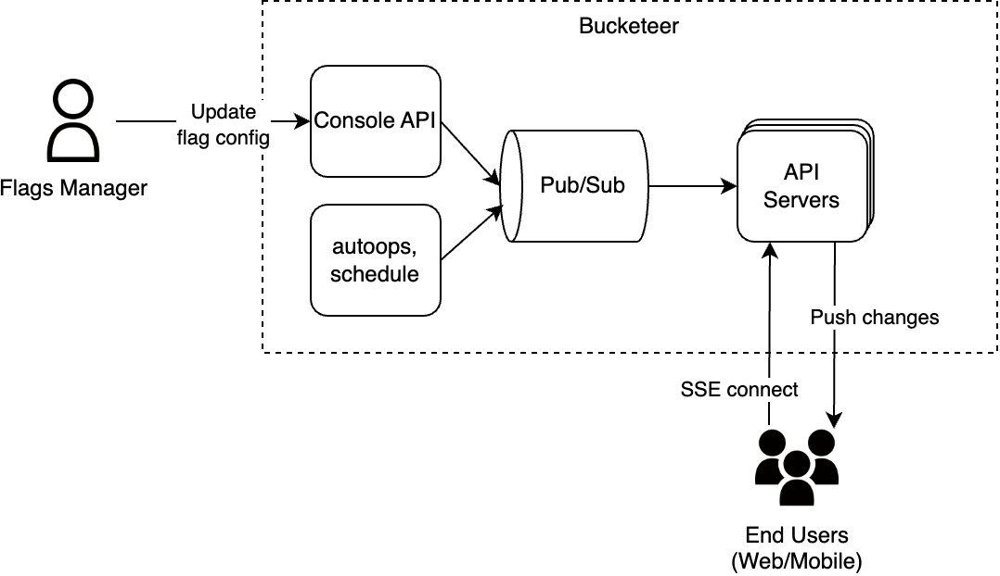
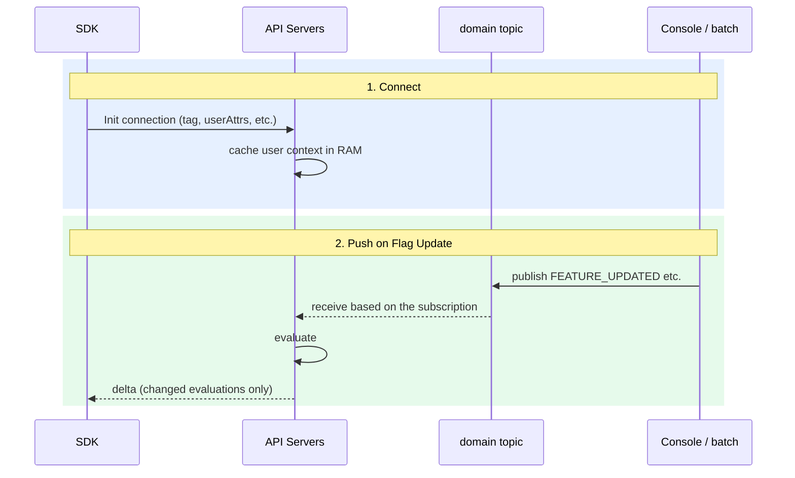

# Massive Real-Time Sync via SSE

This RFC describes the new way to deliver flag changes to Web/Mobile SDKs **within a second** via SSE.

**Issue**: [https://github.com/bucketeer-io/bucketeer/issues/2152](https://github.com/bucketeer-io/bucketeer/issues/2152)

## 1. Background

Currently, the way for client SDKs to receive flag config changes is polling `GetEvaluations`, which has trade-offs around the polling interval.
- Short intervals spike gateway load.
- Long intervals make kill-switches and coordinated launches effectively minute-granular.

That's why we want a push channel delivering changes within 1s.

## 2. Goals / Non-Goals

**Goals.**

- Push changes to opted-in flags on Web/Mobile SDKs
- **Latency**: Sub-second (≤ 1000ms)
- **Concurrency**: 2M concurrent per bucketeer deployment (5M burst).
- **SDKs scope**: JavaScript, iOS, Android (React, Flutter later)
- **Push trigger**: any server-side change on the flag config

**Non-Goal.**

- Server SDKs: handled separately later. Easier than client SDKs.

## 3. Design Overview

The existing API servers will additionally have three responsibilities:

1. Creates and holds SSE connections with user context in memory
2. Re-evaluates flags on flag update events
3. Pushes deltas

### Sequence

## 4. Design Details

### Update Triggers

Subscribe on the domain topic with an explicit Type allowlist.

- `FEATURE_UPDATED`
- `FEATURE_ENABLED`
- `FEATURE_DISABLED`
- `SEGMENT_BULK_UPLOAD_USERS_STATUS_CHANGED`: Push only when `status = SUCCEEDED`.

### Event Fan-out

Each API pod subscribes to domain via a unique per-pod subscription, like `startCacheInvalidator` in `pkg/api/cmd/server.go`. 

### Partitioning of Connections

In order to optimize the fan-out of the flag changes, we will partition the SSE connections by `(envId, tag)` in the API server pods.

### Connection Lifecycle

1. **Connect:** SDK requests an SSE connection with its client info including the tag, user. If the connection and retry fails, SDK uses only polling.
2. **While Connected:** The server will send a heartbeat to SDK periodically.
3. **On User-attribute change:** When SDK detects attribute change locally, it reconnects with new attributes.
4. **On Disconnect:** SDK will reconnect.

### Scaling of API Servers

Currently, the API servers are scaled based on the CPU usage.

We will additionally use the custom metric based on the number of connections, because SSE is CPU-idle and long-lived, which breaks CPU-based HPA.

## 5. Estimations

Target: **15k concurrent connections per pod**. The tag partitioning reduces the flag-update fan-out working set to 1/5.

### Memory per pod

| Component                                     | Size per conn | Basis                                                                      |
| --------------------------------------------- | ------------- | -------------------------------------------------------------------------- |
| User context (envId, tag, userId, attributes) | ~5 KB         | `User` proto with ~15 attrs × ~50 B                                        |
| Last evaluation snapshot (for delta diff)     | ~60 KB        | `map[flagID]lastEvaluationFingerprint`, ~500 flags/env × ~120 B/entry      |
| Connection/runtime overhead                   | ~125 KB       | Go handler/stream state, GC, and TCP overhead. Validate with load testing. |
| **Sum (memory per conn)**                     | **~190 KB**   |                                                                            |

15k conns -> **~2.8 GB pod memory**

### Parallelism

The dispatcher sends flag-update events to the `(envId, tag)` partition's writer channels (~3k in average). Each woken SSE handler goroutine runs Evaluate+Push itself, bounded by `GOMAXPROCS` or an additional parameter. No separate worker pool.

### Pod counts

| Setting       | Value                   |
| ------------- | ----------------------- |
| Per pod       | 15k conns, ~3 Gi memory |
| 2M concurrent | **~135 pods**           |
| 5M burst      | **~335 pods**           |

## 6. Alternatives Considered

### A. Frequent Polling

Shorten the existing `GetEvaluations` poll interval to ~1s.

**Why discarded**: Too much load and cost on the gateway, but most of them are waste.

### B. Notify and Pull

Use SSE just for notifying the changes, and then SDKs will call `GetEvaluations`.

**Why discarded**: The thundering-herd problem. And an extra RTT is added.

### C. Dedicated Servers for SSE Streaming

Run SSE in dedicated servers, not with the API servers.

**Why discarded**: For simplicity. If the load test reveals that the SSE should be tuned more, we can split it out later.

### D. WebSocket

Use WebSocket for pushing, not SSE.

**Why discarded**: WebSocket's bidirectional channel is unused. And its protocol may have restrictions in intermediate stacks.

## 7. Tasks

- **Proto**: Define SSE payload types
- **Backend**:
  - SSE handling
  - Domain topic subscription, re-evaluation, and delta push (mirror `pkg/api/api/cache_invalidator.go`)
  - Prometheus metrics
- **Infra**:
  - Gateway config for allowing SSE
  - Resize memory of API pods
  - HPA on connection count
- **Load Test**
- **Client SDKs**: 
  - must: JavaScript, iOS, Android
  - later: Flutter, React, React Native
