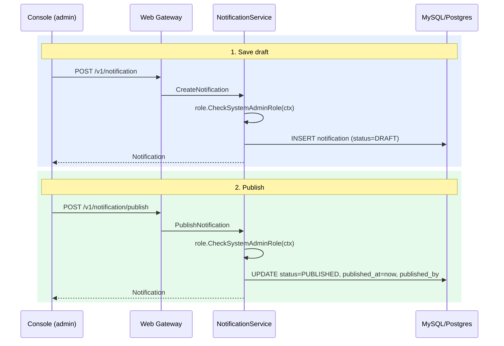
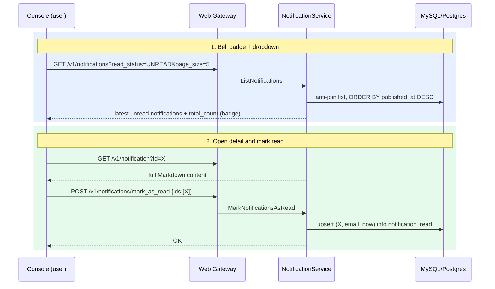

# System Notification Center

This RFC describes the backend design for a notification center in the admin console: system admins author and publish platform-wide announcements (Markdown), and every console user gets an inbox with unread/read tabs, a bell badge, search, date filtering, sorting, and pagination.

**Issue**: [https://github.com/bucketeer-io/bucketeer/issues/2215](https://github.com/bucketeer-io/bucketeer/issues/2215)

## 1. Background

Users currently have no in-product way to learn about platform updates, maintenance windows, known issues, or new features. The existing `notification` domain (`pkg/notification`, `proto/notification`) is **not** this feature: it manages Slack/FCM *subscriptions* that forward domain events (feature changed, experiment finished, …) to external recipients.

This feature is a **broadcast inbox**:

- **System admins** draft, edit, publish, and delete announcements from a "Publish notification" tab.
- **All authenticated console users** see published announcements in Unread / Read tabs, a bell dropdown with the latest unread items, and a detail panel rendering Markdown.

### Naming: rename the legacy domain to `subscription`

The current `notification` domain is misnamed — its RPCs (`CreateSubscription`, …), REST paths (`/v1/subscription(s)`), DB tables (`subscription`, `admin_subscription`), and audit event types (`SUBSCRIPTION_*`) already all say "subscription"; only the folder/proto package/service name say "notification". We rename the wrapper to match (`pkg/subscription`, `proto/subscription`, `SubscriptionService`) and give the `notification` name to this feature.

## 2. Goals / Non-Goals

**Goals.**

- Draft / edit / publish / delete announcements — system admin only.
- Markdown content (rendered client-side; images via external links).
- Per-user read/unread state, unread count for the bell badge and tab counters.
- Announcements are **global** (all organizations, all environments).
- MySQL and PostgreSQL support (same as other `storage/v2` domains).
- Rename the legacy domain to `subscription` first (see Background).

**Non-Goals.**

- Per-organization / per-environment targeting, maybe in the future
- Scheduled publishing (publish-at-future-time).

## 3. Design Overview

The feature is a standard console-facing domain service hosted in the **web** binary, following the `team` domain as the reference implementation:

```
proto/notification/          # messages + service + gateway annotations (new, after rename)
pkg/notification/
├── api/                     # gRPC handlers (auth, validation, events)
├── domain/                  # domain type wrapping the proto
└── storage/                 # interface + mysql/ + postgres/ impls
```

- Registered in `pkg/web/cmd/server/server.go` as a new gRPC service plus a grpc-gateway handler (`RegisterNotificationServiceHandlerFromEndpoint`), exposed under `/v1/notification*` on the web gateway.
- Read state is a per-user marker row; **unread = published notification without a marker row for the viewer's email**, limited to notifications published after the viewer's account was created. No fan-out rows are written at publish time, so publishing is O(1) regardless of user count.

## 4. Design Details

### 4.1 Database Design

Two tables, added to both `migration/mysql/` and `migration/postgres/` (Atlas, `YYYYMMDDHHMMSS_create_notification_tables.sql`). The DDL below is the MySQL version; the PostgreSQL migration uses the equivalent types and syntax (`text` instead of `mediumtext`, `jsonb` instead of `json`, no backticks, and separate `CREATE INDEX` statements instead of inline `KEY`).

```sql
CREATE TABLE `notification` (
    `id`             varchar(255) NOT NULL,            -- UUID
    `title`          varchar(511) NOT NULL,
    `content`        mediumtext   NOT NULL,            -- Markdown source
    `tags`           json         DEFAULT NULL,        -- [{"name": "Announcement", "color": "#3B82F6"}]
    `status`         int          NOT NULL DEFAULT 0,  -- 0: DRAFT, 1: PUBLISHED
    `created_by`     varchar(255) NOT NULL,            -- editor email
    `last_edited_by` varchar(255) NOT NULL,
    `published_by`   varchar(255) DEFAULT NULL,
    `published_at`   bigint       NOT NULL DEFAULT 0,  -- epoch seconds; 0 while draft
    `created_at`     bigint       NOT NULL,
    `updated_at`     bigint       NOT NULL,
    PRIMARY KEY (`id`),
    KEY `idx_status_published_at` (`status`, `published_at`)
);

CREATE TABLE `notification_read` (
    `notification_id` varchar(255) NOT NULL,
    `email`           varchar(255) NOT NULL,    -- viewer identity (global across orgs)
    `read_at`         bigint       NOT NULL,
    PRIMARY KEY (`notification_id`, `email`),
    KEY `idx_email` (`email`),
    CONSTRAINT `fk_notification_read`
        FOREIGN KEY (`notification_id`)
        REFERENCES `notification` (`id`) ON DELETE CASCADE
);
```

Notes:

- **`tags` as JSON** keeps the schema simple; the tag palette (name + color pairs shown in the mockup) is a fixed set defined in the console for v1. If tags later need server-side management, a `notification_tag` master table can be added without touching this schema.
- **`email` as viewer identity**: `account_v2` is keyed by `(email, organization_id)`, so one person has one account row per organization — but all of them share the same email, and the access token carries a single `Email` for the person. Keying read state by email therefore gives one shared read state across organizations for the same person.
- **New users do not inherit history**: the unread definition (badge count and Unread tab) only considers notifications published after the viewer's earliest `account_v2.created_at`. Without this bound, someone joining after a year of announcements would start with hundreds of unread items and a meaningless badge.
- **Growth**: `notification` grows by human-authored rows (tens per month). `notification_read` grows by at most `users × notifications` and only when a user actually reads — negligible at Bucketeer's console-user scale.
- Deleting a notification cascades its read markers. (If we prefer avoiding FKs like the `team` table does, the storage layer deletes both rows in one transaction instead.)

### 4.2 API List

**Viewer APIs** - any authenticated console user (identity = `token.Email` from the access token):

| RPC | HTTP | Description |
|---|---|---|
| `ListNotifications` | `GET /v1/notifications` | Lists published notifications with keyword search, read/unread filter (`read_status`), published date range filter, sorting, and pagination; returns the list and its total count. The notification page calls it once per tab (unread, then read) and uses each `total_count` for the tab counters; the bell badge uses the unread call's `total_count`. |
| `GetNotification` | `GET /v1/notification?id=` | Gets a single notification for the detail panel. Drafts are visible to system admins only. |
| `MarkNotificationsAsRead` | `POST /v1/notifications/mark_as_read` | Marks the given notification ids as read for the viewer. Idempotent. |
| `MarkAllNotificationsAsRead` | `POST /v1/notifications/mark_all_as_read` | Marks all published notifications as read for the viewer. |

**Admin APIs** — `role.CheckSystemAdminRole(ctx)` required:

| RPC | HTTP | Description |
|---|---|---|
| `ListDraftNotifications` | `GET /v1/notifications/drafts` | Lists draft notifications with keyword search, sorting, and pagination; returns the list and its total count. Backs the drafts panel in the "Publish notification" tab; ordered by `created_at` or `updated_at` since drafts have no `published_at`. |
| `CreateNotification` | `POST /v1/notification` | Creates a draft with title, Markdown content, and tags. |
| `UpdateNotification` | `PATCH /v1/notification` | Updates a draft's title, content, or tags; published notifications cannot be edited. |
| `PublishNotification` | `POST /v1/notification/publish` | Publishes a draft; sets `published_at` and `published_by`. |
| `DeleteNotification` | `DELETE /v1/notification?id=` | Deletes a notification along with its read markers. |

### 4.3 Sequence Diagrams

**Draft and publish (system admin):**



No per-user fan-out happens at publish time — visibility is derived at read time from `status = PUBLISHED`.

**Inbox / bell (any user):**



## 5. Implementation Plan

0. **Rename legacy domain** — rename `proto/notification` to `proto/subscription` and `pkg/notification` to `pkg/subscription`, update in-repo clients, protolock, regenerated dashboard client. No external REST or schema change. Must merge before phase 1.
1. **Proto + migration** — new `proto/notification/*`, MySQL + Postgres migrations (`make proto-all`, `migration-validate`).
2. **Backend** — `domain/`, `storage/` (mysql + postgres + tests), `api/` (auth, validation), web server wiring, mocks (`make mockgen`).
3. **Console** — bell + dropdown, Notifications page (Unread/Read/Publish tabs), Markdown editor with preview, detail panel; generated API client from OpenAPI spec.
4. **Docs** — user docs for the publishing workflow.

Phases 2 and 3 can proceed in parallel once the proto contract (phase 1) is merged.

## 6. Open Questions / Risks

- **Editing published notifications**: not allowed in v1; fixing a mistake means deleting and republishing. If we allow it later, we need to decide whether an edited notification becomes unread again for everyone (reset the read markers) or keeps the existing read state.
- **Tag management**: currently no table split.
- **Targeting**: maybe in the future.
- **Retention**: no automatic expiry. If the inbox grows noisy, add an `archived` status and a batch job later; the "Last 30 days" default filter mitigates this in the UI.
- **Auditlog**: for v1, the `created_by`, `last_edited_by`, and `published_by` columns on the `notification` table are sufficient for auditing. Once the admin audit log is developed, this domain will also emit audit-log events for admin mutations (create, update, publish, delete).
