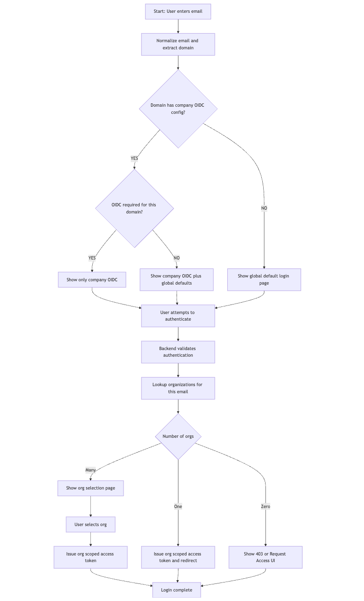

# Domain-Based Authentication Policy Design

## Overview

This document describes the design for a new login workflow where authentication options are determined by the user's email domain. Companies can configure custom OIDC providers and control which authentication methods are available/required for their domain.

## Workflow Summary



The login workflow follows these steps:

```
1. User enters email
2. Normalize email and extract domain
3. Check if domain has company OIDC config
   ├─ YES → Check if OIDC required for this domain
   │   ├─ YES (required=true) → Show only company OIDC
   │   └─ NO (required=false) → Show company OIDC plus global defaults
   └─ NO → Show global default login page
4. User attempts to authenticate
5. Backend validates authentication
6. Lookup organizations for this email
7. Check number of orgs
   ├─ Many → Show org selection page → User selects org
   ├─ One → Issue org-scoped access token and redirect
   └─ Zero → Show 403 or Request Access UI
8. Login complete
```

## Design Decisions

### Data Storage Architecture

**Decision: Create a separate `domain_auth_policy` table**

**Rationale:**
1. **Domain ≠ Organization**: Multiple organizations can share a domain (e.g., different teams at shop.com). The domain policy should be centralized.
2. **Lookup efficiency**: We need to look up by domain first, before we know the organization.
3. **Admin-managed**: Domain policies are configured by Bucketeer admins, not by organization owners.
4. **Security**: Domain-level policies can enforce SSO requirements across all orgs.

### Key Design Considerations

| Consideration | Decision |
|---------------|----------|
| Domain Verification | **Not required** - Domains are configured by Bucketeer admins. |
| Subdomain Handling | **No inheritance** - Each domain is configured explicitly by admin. |
| Default Auth | **Google OIDC** is the global default for all domains without a policy. |
| Fallback on Failure | **No fallback** - On auth failure, redirect user back to login page to choose another method. |
| Policy Management | **Bucketeer system admins** - Not organization owners. |

### Data Model Design

```
Domain Auth Policy (domain_auth_policy)
├── domain (primary key) - "shop.com"
├── auth_policy (JSON) - Full policy configuration
├── enabled - Is this policy active?
└── metadata (timestamps, etc.)

Flow:
User email: john@shop.com
  → Extract domain: shop.com
  → Lookup domain_auth_policy WHERE domain = 'shop.com'
  → Return available auth methods
  → User authenticates
  → Lookup all orgs where user has account
  → Issue token for selected org
```

---

## Database Schema Changes

### New Table: `domain_auth_policy`

```sql
CREATE TABLE `domain_auth_policy` (
  `domain` VARCHAR(255) NOT NULL,
  `auth_policy` JSON NOT NULL,
  `enabled` BOOLEAN NOT NULL DEFAULT TRUE,
  `created_at` BIGINT NOT NULL,
  `updated_at` BIGINT NOT NULL,
  PRIMARY KEY (`domain`)
) ENGINE=InnoDB DEFAULT CHARSET=utf8mb4;
```

**Note:** No `owner_organization_id` or `domain_verified` fields since domain policies are managed by Bucketeer system admins, not organization owners.

### Auth Policy JSON Schema

```json
{
  "domain": "shop.com",
  "authPolicy": {
    "password": {
      "enabled": true,
      "required": false
    },
    "googleOidc": {
      "enabled": true,
      "required": false
    },
    "companyOidc": {
      "enabled": true,
      "required": true,
      "issuer": "https://login.shop.com/oidc",
      "clientId": "bucketeer-client-id",
      "clientSecret": "encrypted:xxxxx",
      "redirectUri": "https://console.bucketeer.io/oauth/callback",
      "scopes": ["openid", "email", "profile"],
      "displayName": "Shop.com SSO"
    }
  }
}
```

---

## Proto Definitions

### New Proto File: `proto/auth/domain_policy.proto`

```protobuf
syntax = "proto3";

package bucketeer.auth;

option go_package = "github.com/bucketeer-io/bucketeer/proto/auth";

message PasswordAuthOption {
  bool enabled = 1;
  bool required = 2;
}

message GoogleOidcOption {
  bool enabled = 1;
  bool required = 2;
}

message CompanyOidcOption {
  bool enabled = 1;
  bool required = 2;
  string issuer = 3;
  string client_id = 4;
  string client_secret = 5;  // Never returned to client
  string redirect_uri = 6;
  repeated string scopes = 7;
  string display_name = 8;
}

message AuthPolicy {
  PasswordAuthOption password = 1;
  GoogleOidcOption google_oidc = 2;
  CompanyOidcOption company_oidc = 3;
}

message DomainAuthPolicy {
  string domain = 1;
  AuthPolicy auth_policy = 2;
  bool enabled = 3;
  int64 created_at = 4;
  int64 updated_at = 5;
}

// Client-safe version (no secrets)
message DomainAuthOptions {
  string domain = 1;
  bool password_enabled = 2;
  bool google_enabled = 3;
  bool company_oidc_enabled = 4;
  string company_oidc_display_name = 5;
  string company_oidc_auth_url = 6;  // Pre-built auth URL
  bool oidc_required = 7;  // If true, only company OIDC allowed
}
```

### Update: `proto/auth/service.proto`

```protobuf
// New RPC methods

// Get auth options for an email domain (public, no auth required)
rpc GetAuthOptionsByEmail(GetAuthOptionsByEmailRequest) returns (GetAuthOptionsByEmailResponse) {}

// Authenticate with company OIDC
rpc GetCompanyOidcAuthURL(GetCompanyOidcAuthURLRequest) returns (GetCompanyOidcAuthURLResponse) {}
rpc ExchangeCompanyOidcToken(ExchangeCompanyOidcTokenRequest) returns (ExchangeCompanyOidcTokenResponse) {}

// Note: Use existing GetMyOrganizations RPC from account service
// (after successful auth, not part of auth service)

// Admin: Manage domain auth policies
rpc CreateDomainAuthPolicy(CreateDomainAuthPolicyRequest) returns (CreateDomainAuthPolicyResponse) {}
rpc UpdateDomainAuthPolicy(UpdateDomainAuthPolicyRequest) returns (UpdateDomainAuthPolicyResponse) {}
rpc GetDomainAuthPolicy(GetDomainAuthPolicyRequest) returns (GetDomainAuthPolicyResponse) {}
rpc DeleteDomainAuthPolicy(DeleteDomainAuthPolicyRequest) returns (DeleteDomainAuthPolicyResponse) {}
rpc ListDomainAuthPolicies(ListDomainAuthPoliciesRequest) returns (ListDomainAuthPoliciesResponse) {}

// Messages
message GetAuthOptionsByEmailRequest {
  string email = 1;
}

message GetAuthOptionsByEmailResponse {
  DomainAuthOptions options = 1;
}

message GetCompanyOidcAuthURLRequest {
  string email = 1;
  string state = 2;
  string redirect_url = 3;
}

message GetCompanyOidcAuthURLResponse {
  string url = 1;
}

message ExchangeCompanyOidcTokenRequest {
  string code = 1;
  string state = 2;
  string redirect_url = 3;
  string email = 4;  // Original email to verify domain
}

message ExchangeCompanyOidcTokenResponse {
  Token token = 1;  // Temporary token, not org-scoped yet
  repeated OrganizationSummary organizations = 2;
}

// Note: Use existing Organization message from environment.proto
// and GetMyOrganizationsRequest/Response from account service
```

---

## Service Implementation

### Package Structure

```
pkg/auth/
├── api/
│   ├── api.go                    # Main service (update)
│   ├── domain_policy.go          # NEW: Domain policy handlers
│   └── company_oidc.go           # NEW: Company OIDC handlers
├── domain/
│   ├── credentials.go            # Existing
│   └── domain_policy.go          # NEW: Domain policy entity
├── storage/
│   ├── credentials.go            # Existing
│   ├── domain_policy.go          # NEW: Domain policy storage
│   └── sql/
│       ├── credentials/          # Existing
│       └── domain_policy/        # NEW
│           ├── insert.sql
│           ├── select_by_domain.sql
│           ├── update.sql
│           └── delete.sql
├── oidc/
│   ├── provider.go               # NEW: Generic OIDC provider
│   ├── discovery.go              # NEW: OIDC discovery
│   └── token.go                  # NEW: OIDC token handling
└── google/
    └── authenticator.go          # Existing (refactor to use common OIDC)
```

### Implementation Notes

The implementation will include:

1. **Domain Policy Management**
   - Storage layer for domain auth policies
   - CRUD operations for system admins
   - Email normalization and domain extraction utilities

2. **Authentication Options Discovery**
   - Lookup domain policy by email
   - Return available auth methods based on policy
   - Fallback to global defaults (Google OIDC)

3. **Company OIDC Integration**
   - OIDC provider discovery and configuration
   - Authorization URL generation with state parameter
   - Token exchange and validation
   - User info extraction from ID token

4. **Security Measures**
   - Client secret encryption at rest
   - State parameter validation
   - Email domain verification
   - Rate limiting on lookups

---

## Security Considerations

1. **Client Secret Storage**: Encrypt at rest using AES-256-GCM
2. **State Parameter**: Use signed, time-limited tokens with email embedded
3. **Email Matching**: Strictly verify authenticated email domain matches policy domain
4. **Rate Limiting**: Add rate limits on domain policy lookups
5. **Audit Logging**: Log all authentication attempts and policy changes
6. **Admin-Only Policy Management**: Only Bucketeer system admins can create/modify domain policies
7. **No Fallback on Failure**: Auth failures redirect to login page; user must choose another method

---

## Configuration

### Global Defaults (when no domain policy exists)

When a user's email domain has no configured policy, the system uses these defaults:

```yaml
auth:
  globalDefaults:
    password:
      enabled: false    # Not enabled by default
    google:
      enabled: true     # Google OIDC is the global default for all users
    # Company OIDC not available as global default (requires domain policy)
```

**Important:** Google OIDC is always available as a fallback for domains without a specific policy. This ensures all users can authenticate even if their domain hasn't been configured.

### Environment Variables

```bash
# Encryption key for storing OIDC client secrets
AUTH_SECRET_ENCRYPTION_KEY=base64-encoded-32-byte-key

# Default redirect URI for OIDC callbacks
AUTH_OIDC_DEFAULT_REDIRECT_URI=https://console.bucketeer.io/oauth/callback
```

---

## API Flow Examples

### Example 1: User with Company OIDC Required

```
1. Frontend: POST /auth/options
   Request: { "email": "john@shop.com" }
   Response: {
     "options": {
       "domain": "shop.com",
       "password_enabled": false,
       "google_enabled": false,
       "company_oidc_enabled": true,
       "company_oidc_display_name": "Shop.com SSO",
       "oidc_required": true
     }
   }

2. Frontend: Shows only "Login with Shop.com SSO" button

3. Frontend: POST /auth/company-oidc/url
   Request: { "email": "john@shop.com", "state": "xyz" }
   Response: { "url": "https://login.shop.com/oidc/auth?..." }

4. Browser: Redirects to company IdP

5. IdP: Authenticates user, redirects to callback

6. Frontend: POST /auth/company-oidc/token
   Request: { "code": "abc", "state": "xyz" }
   Response: {
     "token": { "access_token": "temp-token", ... },
     "organizations": [
       { "id": "org1", "name": "Shop Engineering" },
       { "id": "org2", "name": "Shop Marketing" }
     ]
   }

7. Frontend: Shows org selection (if multiple)

8. Frontend: POST /auth/switch-organization
   Request: { "organization_id": "org1" }
   Response: { "token": { "access_token": "org-scoped-token", ... } }

9. Login complete
```

### Example 2: User with Multiple Auth Options

```
1. Frontend: POST /auth/options
   Request: { "email": "jane@techcorp.io" }
   Response: {
     "options": {
       "domain": "techcorp.io",
       "password_enabled": true,
       "google_enabled": true,
       "company_oidc_enabled": true,
       "company_oidc_display_name": "TechCorp SSO",
       "oidc_required": false
     }
   }

2. Frontend: Shows all three options:
   - Password login form
   - "Login with Google" button
   - "Login with TechCorp SSO" button

3. User chooses preferred method and completes auth
```

### Example 3: User with No Domain Policy

```
1. Frontend: POST /auth/options
   Request: { "email": "freelancer@gmail.com" }
   Response: {
     "options": {
       "domain": "gmail.com",
       "password_enabled": false,  // Global default
       "google_enabled": true,     // Global default
       "company_oidc_enabled": false,
       "oidc_required": false
     }
   }

2. Frontend: Shows Google login only
```

---

## Additional Considerations

### OIDC Provider Caching

**Consideration:** Caching strategy for OIDC provider discovery information.

**Recommendation:** Cache OIDC provider discovery info for 1 hour with background refresh to balance performance and configuration update responsiveness.

### Migration Path for Existing Users

**Consideration:** Handling existing Google-authenticated users when a domain policy is added that requires company OIDC.

**Recommendation:**
- Existing sessions remain valid until expiry
- New logins must use the newly configured company OIDC
- Users are notified of the authentication method change upon next login
