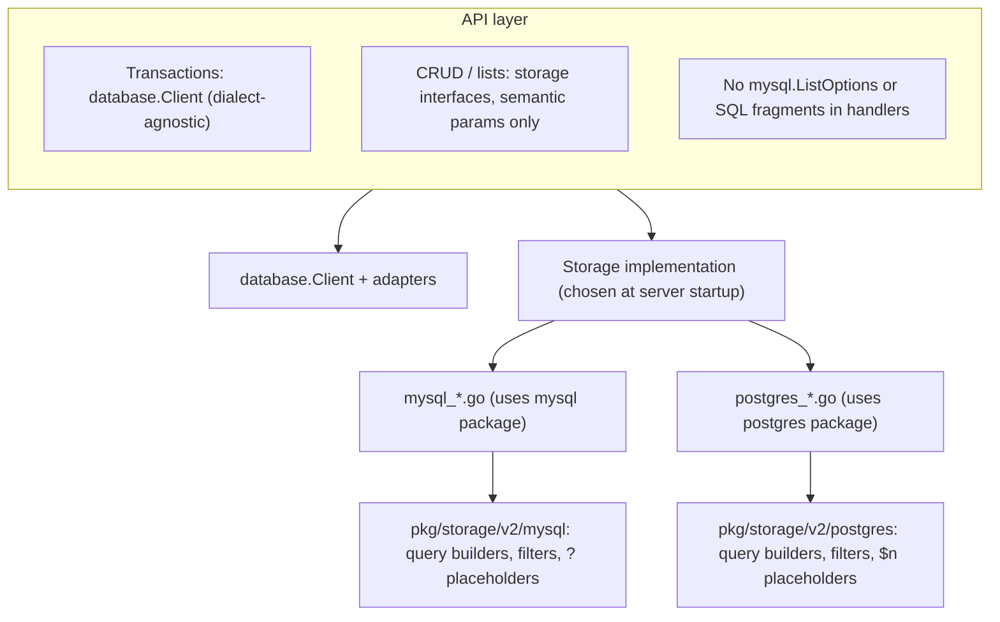

# RFC: Polymorphic Database Storage Layer

## Contents

**Roman numerals** (I., II., …) apply only to top-level `##` sections. Subsections (`###`) use plain titles.

- [I. Summary](#i-summary)
- [II. Background](#ii-background)
- [III. Problem: API layer builds queries via filter types](#iii-problem-api-layer-builds-queries-via-filter-types)
  - [Symptoms](#symptoms)
  - [Why this matters](#why-this-matters)
- [IV. Goals](#iv-goals)
- [V. Design overview](#v-design-overview)
  - [Architecture layers](#architecture-layers)
  - [1. Unified database client (transactions)](#1-unified-database-client-transactions)
  - [2. Split query packages and storage implementations](#2-split-query-packages-and-storage-implementations)
  - [3. List query semantics live in storage](#3-list-query-semantics-live-in-storage)
  - [4. Shared neutral types (optional, limited)](#4-shared-neutral-types-optional-limited)
- [VI. Alternative considered: unified client and `?` → `$N` replacement (Option B)](#vi-alternative-considered-unified-client-and---n-replacement-option-b)
  - [Problems with that approach](#problems-with-that-approach)
  - [Why we chose split query + split storage paths](#why-we-chose-split-query--split-storage-paths)
- [VII. SQL compatibility (reference)](#vii-sql-compatibility-reference)
  - [Placeholders](#placeholders)
  - [JSON](#json)
  - [Upsert](#upsert)
  - [Auto-increment vs serial](#auto-increment-vs-serial)
  - [Transaction propagation](#transaction-propagation)
- [VIII. Affected packages](#viii-affected-packages)
- [IX. Implementation examples](#ix-implementation-examples)
  - [Unified database client and transactions](#unified-database-client-and-transactions)
  - [PostgreSQL filter package](#postgresql-filter-package)
  - [API layer changes](#api-layer-changes)
  - [Storage layer: queries in mysql and postgres packages](#storage-layer-queries-in-mysql-and-postgres-packages)
- [X. Testing strategy](#x-testing-strategy)
- [XI. Trade-offs](#xi-trade-offs)
  - [Advantages](#advantages)
  - [Disadvantages](#disadvantages)
- [XII. Implementation timeline (indicative)](#xii-implementation-timeline-indicative)
- [XIII. Appendix: Example SQL outputs (illustrative)](#xiii-appendix-example-sql-outputs-illustrative)

## I. Summary

This RFC proposes PostgreSQL as an alternative primary storage backend alongside MySQL, selected at runtime via configuration. The API layer depends on a unified `database.Client` for transactions and on **storage interfaces that use database-agnostic parameters**—not on MySQL query types. **Query construction stays split by dialect**: `pkg/storage/v2/mysql` and `pkg/storage/v2/postgres` each own placeholders, JSON predicates, and helpers; **domain storage packages** provide separate implementations (e.g. `mysql_feature.go`, `postgres_feature.go`) or factories that wire the correct implementation at startup. **List and filter semantics** (what the user asked for) live in the storage layer; the API passes structs and enums derived from RPC validation, not `mysql.ListOptions` or raw SQL fragments.

## II. Background

Bucketeer services are tightly coupled to MySQL for primary storage:

1. **API layer holds MySQL clients and types**  
   Services such as `PushService` use `mysql.Client` directly, and list endpoints often build `mysql.ListOptions`, `mysql.FilterV2`, `mysql.JSONFilter`, and `mysql.Order` in the API package.

2. **Storage implementations depend on MySQL**  
   Storage structs use `mysql.QueryExecer`; interfaces expose methods that take `*mysql.ListOptions`, which pins every caller and mock to MySQL.

3. **MySQL-specific concerns leak upward**  
   JSON serialization, duplicate-key and no-rows errors, placeholder style (`?` vs `$1`), and query-builder types are visible outside storage.

PostgreSQL is already used for the data warehouse (eventcounter). Primary OLTP storage needs a clearer boundary: **transactions** can be abstracted once; **SQL shape** cannot be fully hidden without either fragile shortcuts or repeated `if postgres` branches.

## III. Problem: API layer builds queries via filter types

A major blocker for polymorphic storage is not only `mysql.Client` on services but **list and filter logic living in the API layer** using types that are really **query builder fragments**.

### Symptoms

- The API imports `pkg/storage/v2/mysql` to construct `[]*mysql.FilterV2`, `[]*mysql.JSONFilter`, `*mysql.SearchQuery`, `[]*mysql.Order`, and `*mysql.ListOptions`.
- **`FilterV2.Column` is sometimes a full SQL expression**, not a column name. For example, listing features with “has feature flag as rule” uses MySQL-specific JSON functions in the column slot:

  ```go
  filters = append(filters, &mysql.FilterV2{
      Column:   "JSON_CONTAINS(JSON_EXTRACT(rules, '$[*].clauses[*].operator'), '11')",
      Operator: mysql.OperatorEqual,
      Value:    true,
  })
  ```

  PostgreSQL would need a different predicate (`jsonb_path_exists`, `@>`, etc.). No amount of `?` → `$1` rewriting fixes that.

- **Ordering** is mapped in the API with names like `newListFeaturesOrdersMySQL`, producing SQL-oriented values (qualified columns and expressions such as `(progressive_rollout_count + schedule_count + kill_switch_count)`).
- **Storage interfaces** expose `ListFeatures(ctx, *mysql.ListOptions)`, so the API must speak MySQL to call storage—this contradicts the goal of database selection by configuration only.

### Why this matters

- Polymorphic backends require **dialect-specific predicates** for JSON, upsert, and some aggregates. If the API continues to assemble `mysql.ListOptions`, every new endpoint duplicates that coupling.
- The RFC goal “no database-specific conditionals in the API layer” is violated as long as the API builds MySQL filters and embeds MySQL SQL in struct fields meant for columns.

**Decision:** Treat list/filter **intent** as part of the storage contract. The API validates auth and request shape, then calls storage with **semantic parameters** (environment ID, tag list, enums for order and status, optional booleans, pagination). Each storage implementation maps those parameters to its own list options and SQL.

## IV. Goals

1. Enable PostgreSQL as an alternative primary storage backend alongside MySQL.
2. Select the database via configuration; **API business logic does not branch on dialect** and does not import mysql/postgres query types for lists.
3. Maintain backward compatibility for existing MySQL deployments.
4. Keep a small unified surface for **transactions** (`database.Client`) where it reduces boilerplate.
5. Accept **duplication across MySQL and PostgreSQL storage paths** where it keeps SQL explicit and avoids a single mega-implementation full of `if dbType`.

## V. Design overview

### Architecture layers



### 1. Unified database client (transactions)

`database.Client` wraps the existing MySQL and PostgreSQL clients for **`RunInTransactionV2` and `Close` only**. Storage continues to execute queries through a **`QueryExecer`** that respects the transactional context (same pattern as today: transaction attached to `context`, client methods dispatch to the active tx).

```go
// pkg/storage/v2/database/client.go
package database

import "context"

type Client interface {
    RunInTransactionV2(ctx context.Context, f func(ctx context.Context) error) error
    Close() error
}
```

Adapters delegate to `mysql.Client` / `postgres.Client` and strip the unused `Transaction` argument from the callback while preserving context-based tx propagation inside the underlying client.

### 2. Split query packages and storage implementations

**MySQL** and **PostgreSQL** each keep their own:

- Placeholder style (`?` vs numbered `$n`).
- Filter / list helpers that implement a shared **conceptual** model (equality, IN, NULL, JSON contains, search, ORDER BY) with **different `SQLString()` (or equivalent) output**.
- Any dialect-specific upsert, JSON, or locking syntax.

Domain storage (e.g. `pkg/feature/storage/v2`) exposes:

- A **storage interface** that uses **semantic list parameters**, not `*mysql.ListOptions`.
- **`NewMySQLFeatureStorage(qe mysql.QueryExecer) FeatureStorage`** and **`NewPostgresFeatureStorage(qe postgres.QueryExecer) FeatureStorage`** (names illustrative), or a factory in `server` that picks one.

Simple CRUD can remain one file per dialect or share scanning helpers; **list methods** translate semantic params → `mysql.ListOptions` or `postgres.ListOptions` **inside** the implementation file for that backend.

### 3. List query semantics live in storage

**Example direction for feature listing:**

```go
// pkg/feature/storage/v2 — semantic, no mysql import required for callers

type ListFeaturesParams struct {
    EnvironmentID         string
    Tags                  []string
    Maintainer            string
    Enabled               *bool
    Archived              *bool
    HasPrerequisites      *bool
    HasFeatureFlagAsRule  *bool
    SearchKeyword         string
    Status                featureproto.FeatureLastUsedInfo_Status
    OrderBy               featureproto.ListFeaturesRequest_OrderBy
    OrderDirection        featureproto.ListFeaturesRequest_OrderDirection
    Limit                 int
    Offset                int
}

type FeatureStorage interface {
    ListFeatures(ctx context.Context, p ListFeaturesParams) ([]*featureproto.Feature, int, int64, error)
    ListFeaturesFilteredByExperiment(ctx context.Context, p ListFeaturesParams) ([]*featureproto.Feature, int, int64, error)
    // ... other methods without *mysql.ListOptions in the public interface
}
```

- **`mysql` implementation**: maps `p` to `*mysql.ListOptions`, including translating `HasFeatureFlagAsRule` into `JSON_CONTAINS(JSON_EXTRACT(...))` (or a dedicated helper in `pkg/storage/v2/mysql`).
- **`postgres` implementation**: maps the same `p` into postgres list options with JSONB predicates that express the same intent.

The API calls `ListFeatures(ctx, ListFeaturesParams{...})` after unmarshalling and permission checks; it does not reference `mysql.JSONFilter` or SQL strings.

### 4. Shared neutral types (optional, limited)

Where several domains need the same **pure data** shape (e.g. operator enum, order direction as int), those can live in `pkg/storage/v2/database` **without** `SQLString()`. Dialect packages embed or convert them. This is optional; avoiding a heavy shared query DSL is fine as long as **SQL emission stays in mysql/postgres or in `*_mysql.go` / `*_postgres.go`**.

## VI. Alternative considered: unified client and `?` → `$N` replacement (Option B)

We considered a **single** `database` package with one `QueryExecer`, a `dbType` field, **automatic replacement** of `?` with `$1`, `$2`, … at execution time (similar in spirit to [sqlx `Rebind`](https://github.com/jmoiron/sqlx/blob/master/bind.go)), unified error translation, and optionally a single storage implementation for both databases.

### Problems with that approach

1. **Placeholder rewriting is not SQL-aware**  
   Typical implementations scan the string for `?` and replace in order. That breaks if `?` appears inside a string literal or comment; sqlx documents this limitation explicitly. Safer approaches either restrict all SQL to fixed templates or emit `$n` at build time (as GORM does per dialect via `BindVarTo`).

2. **Dialect differences are not only placeholders**  
   JSON (`JSON_CONTAINS` vs `@>` / `jsonb_path_exists`), upsert (`ON DUPLICATE KEY UPDATE` vs `ON CONFLICT ... DO UPDATE`), some aggregates and full-text APIs differ. A unified implementation either **branches on `dbType` everywhere** (collapsing into one file of conditionals) or still needs separate SQL strings per dialect—so the “single implementation” win is small.

3. **API-embedded SQL fragments make unified SQL untenable**  
   Even with perfect placeholder replacement, expressions like `JSON_CONTAINS(JSON_EXTRACT(rules, ...))` in filter “columns” must become postgres-specific text. That logic cannot live in a generic `ReplacePlaceholders` pass; it belongs next to the backend that understands the schema.

4. **Transaction path must rewrite consistently**  
   Every execution path (`ExecContext`, `QueryContext`, on pooled `DB` and on `Tx`) must apply the same rules; a single bug duplicates subtle production errors.

### Why we chose split query + split storage paths

- **Explicit SQL per dialect** is easier to review and test than a large `if dbType` matrix.
- **Placeholders** are correct by construction in each package (`?` vs `$n` indexing), matching how ORMs like GORM generate SQL.
- **List intent** in the storage API prevents the feature (and other) API packages from becoming query builders.

We keep the **unified client only where the abstraction is honest**: transactions and startup wiring, not “one string fits all databases.”

## VII. SQL compatibility (reference)

### Placeholders

- MySQL: `?`
- PostgreSQL: `$1`, `$2`, …

### JSON

- MySQL: `JSON_CONTAINS`, `JSON_EXTRACT`, etc.
- PostgreSQL: JSONB operators and functions (`@>`, `jsonb_path_exists`, `jsonb_array_length`, …)

### Upsert

| Aspect          | MySQL                          | PostgreSQL                             |
| --------------- | ------------------------------ | -------------------------------------- |
| Clause          | `ON DUPLICATE KEY UPDATE`      | `ON CONFLICT (...) DO UPDATE SET`      |
| Conflict target | Implicit from unique/PK        | Must match a unique index / constraint |
| Updated values  | `VALUES(col)` (legacy) / alias | `EXCLUDED.col`                         |

Per-dialect helpers (in `mysql` / `postgres` packages or next to the storage impl) should generate the appropriate clause; PostgreSQL requires schema-level unique constraints that align with the chosen conflict target.

### Auto-increment vs serial

Handled in migrations (MySQL `AUTO_INCREMENT`, PostgreSQL `SERIAL` / `IDENTITY`). Application code may need `RETURNING` for last-insert id on PostgreSQL where MySQL used `LastInsertId`.

### Transaction propagation

Today, transactional execution uses **context** (transaction value on context) and a **client** that implements `QueryExecer`. Any unified `database.Client` used only for `RunInTransactionV2` must not break that pattern: storage must still run queries through a `QueryExecer` that participates in the same transaction.

## VIII. Affected packages

Refactoring touches storage and APIs that currently import mysql list types or construct filters in the API layer, including but not limited to:

- `pkg/account/storage/v2`
- `pkg/feature/storage/v2`
- `pkg/experiment/storage/v2`
- `pkg/environment/storage/v2`
- `pkg/push/storage/v2`
- `pkg/notification/storage/v2`
- `pkg/autoops/storage/v2`
- `pkg/auditlog/storage/v2`
- `pkg/tag/storage`
- `pkg/team/storage`
- `pkg/mau/storage`
- `pkg/opsevent/storage/v2`
- `pkg/coderef/storage`
- `pkg/subscriber/storage/v2`
- `pkg/experimentcalculator/storage/v2`
- `pkg/eventcounter/storage/v2`

## IX. Implementation examples

This section walks through one vertical slice (feature listing is a good reference) in the order code is wired: **client → postgres filters → API → storage** with dialect-specific query construction.

### Unified database client and transactions

The API depends on `database.Client` only to run work inside a transaction. Adapters wrap the existing `mysql.Client` / `postgres.Client` and forward `RunInTransactionV2` while keeping **transaction propagation on `context`** (the underlying client attaches the active `Transaction` to context; `ExecContext` / `QueryContext` on that client use the tx when present).

```go
// pkg/storage/v2/database — narrow interface
type Client interface {
    RunInTransactionV2(ctx context.Context, f func(ctx context.Context) error) error
    Close() error
}

// Adapter example: delegate to mysql.Client, drop unused tx param in callback
func (c *mysqlClientAdapter) RunInTransactionV2(ctx context.Context, f func(ctx context.Context) error) error {
    return c.mc.RunInTransactionV2(ctx, func(ctx context.Context, _ mysql.Transaction) error {
        return f(ctx)
    })
}
```

**Storage** still receives a **`QueryExecer`** (`mysql.Client` or `postgres.Client` implementing `ExecContext` / `QueryContext` / `QueryRowContext`) so queries run on the pool or on the transactional connection via context. The unified `database.Client` does not replace `QueryExecer` for CRUD unless you explicitly design a facade that implements both.

### PostgreSQL filter package

`pkg/storage/v2/postgres` grows types analogous to `mysql` (e.g. `FilterV2`, `ListOptions`, `JSONFilter`, `Order`) but **`SQLString()` emits `$1`, `$2`, …** using a running index, and JSON helpers use **JSONB** (`@>`, `jsonb_array_length`, …). Helpers such as `WritePlaceHolder` (already present) can format grouped placeholders.

Illustrative shape (not the full API):

```go
// pkg/storage/v2/postgres — placeholder index threaded through list construction
type FilterV2 struct {
    Column   string
    Operator Operator
    Value    interface{}
    index    *int // shared counter across WHERE parts
}

func (f *FilterV2) SQLString() (string, []interface{}) {
    *f.index++
    op := "=" // same operator map idea as pkg/storage/v2/mysql
    return fmt.Sprintf("%s %s $%d", f.Column, op, *f.index), []interface{}{f.Value}
}

// JSON contains tags — contrast with mysql.JSON_CONTAINS
func (j *JSONFilter) SQLString() (string, []interface{}) {
    *j.index++
    return fmt.Sprintf("%s @> $%d::jsonb", j.Column, *j.index), []interface{}{formatJSONBArr(j.Values)}
}
```

List assembly mirrors `mysql.ConstructQueryAndWhereArgs` / count helpers but never uses `?`.

### API layer changes

Services hold **`database.Client`** for transactions and **`FeatureStorage`** (or domain equivalent) for persistence. List RPC handlers **do not** import `mysql` or build `ListOptions`; they pass a **semantic struct** after auth and validation.

**Before (problematic):**

```go
options := &mysql.ListOptions{
    Filters: []*mysql.FilterV2{{Column: "feature.environment_id", Operator: mysql.OperatorEqual, Value: envID}},
    // ...
}
features, _, _, err := s.featureStorage.ListFeatures(ctx, options)
```

**After:**

```go
params := v2fs.ListFeaturesParams{
    EnvironmentID: req.EnvironmentId,
    Tags:          req.Tags,
    // ... enums, optional bools, pagination from req
}
features, cursor, total, err := s.featureStorage.ListFeatures(ctx, params)
```

`server` wiring selects `NewMySQLFeatureStorage(mysqlClient)` or `NewPostgresFeatureStorage(postgresClient)` from config; `FeatureService` only sees `FeatureStorage` + `database.Client`.

### Storage layer: queries in mysql and postgres packages

Each dialect implementation maps **`ListFeaturesParams` → native list options → SQL**.

**MySQL** (`feature_mysql.go` or equivalent) builds `*mysql.ListOptions`, then uses existing helpers against embedded SQL templates:

```go
func (s *featureStorageMySQL) ListFeatures(ctx context.Context, p ListFeaturesParams) ([]*featureproto.Feature, int, int64, error) {
    opts := buildMySQLListOptions(p) // FilterV2, JSONFilter, Order — may include JSON_CONTAINS / JSON_EXTRACT for rule filters
    query, args := mysql.ConstructQueryAndWhereArgs(selectFeaturesSQLQuery, opts)
    rows, err := s.qe.QueryContext(ctx, query, args...)
    // scan...
}
```

**PostgreSQL** (`feature_postgres.go`) builds `*postgres.ListOptions` with the same *intent* but different `SQLString()` output, then uses postgres `ConstructQueryAndWhereArgs` (or equivalent):

```go
func (s *featureStoragePostgres) ListFeatures(ctx context.Context, p ListFeaturesParams) ([]*featureproto.Feature, int, int64, error) {
    opts := buildPostgresListOptions(p) // same p, different predicates e.g. jsonb_path_exists / @> for rules
    query, args := postgres.ConstructQueryAndWhereArgs(selectFeaturesSQLQuery, opts)
    rows, err := s.qe.QueryContext(ctx, query, args...)
    // scan identical proto rows
}
```

The **embedded base SELECT** (`select_features.sql`) can stay one file per dialect if fragments differ, or share a static `SELECT ... FROM feature ...` string with dialect-specific `WHERE` composition only—either way, **the strings that differ (JSON, upsert)** live next to `mysql` or `postgres` helpers, not in `pkg/feature/api`.

## X. Testing strategy

1. **Storage unit tests** per dialect for list-parameter mapping and query construction (including JSON and edge filters).
2. **API unit tests** use the `FeatureStorage` (etc.) interface with mocks that accept **semantic params**, not `*mysql.ListOptions`.
3. **Integration / E2E** run against MySQL and, as coverage grows, PostgreSQL.

## XI. Trade-offs

### Advantages

- Clear ownership: **API** = auth, validation, orchestration; **storage** = persistence and SQL shape.
- PostgreSQL support without smuggling MySQL expressions through generic filter fields.
- Easier code review than a single dialect-agnostic query interpreter.

### Disadvantages

- More files and some duplicated mapping logic between `*_mysql.go` and `*_postgres.go`.
- Broader test matrix (both databases for behavior that differs).

## XII. Implementation timeline (indicative)

| Phase | Description                                                                                                                                              |
| ----- | -------------------------------------------------------------------------------------------------------------------------------------------------------- |
| 1     | Harden `pkg/storage/v2/postgres` query/list helpers to parity with mysql where needed; unified `database.Client` adapters if not already done.           |
| 2     | Introduce semantic list params and refactor **feature** storage + API as the reference pattern; remove mysql filter construction from `pkg/feature/api`. |
| 3     | PostgreSQL schema migrations aligned with MySQL semantics (types, uniques for upsert).                                                                   |
| 4     | Repeat storage split + API decoupling for remaining packages in the affected list.                                                                       |

---

## XIII. Appendix: Example SQL outputs (illustrative)

```sql
-- MySQL list fragment
SELECT * FROM feature WHERE environment_id = ? AND JSON_CONTAINS(tags, ?)

-- PostgreSQL equivalent intent
SELECT * FROM feature WHERE environment_id = $1 AND tags @> $2::jsonb
```

These strings are built inside dialect-specific code paths, not in the API layer.
