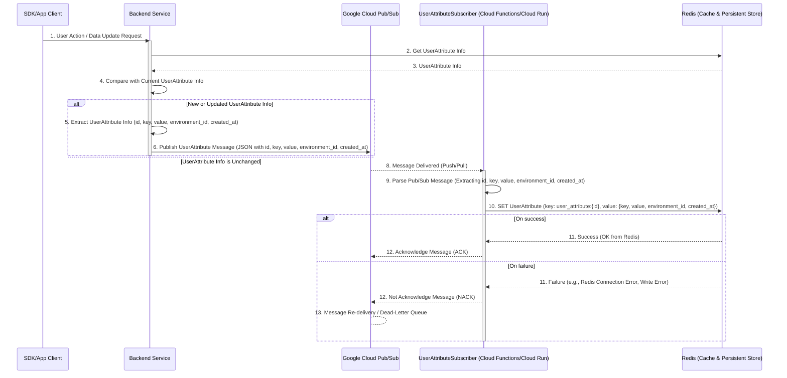
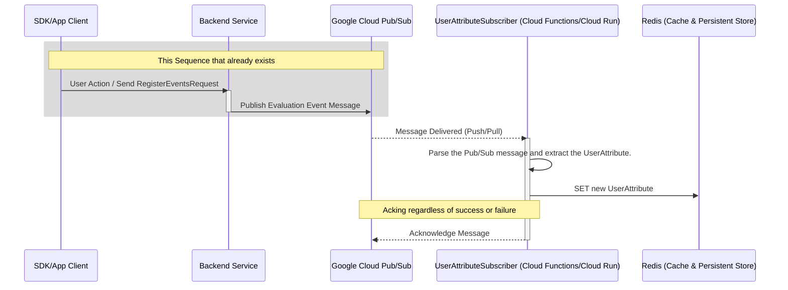

# Summary

Currently, when users configure rules on the Targeting tab in the console, they need to manually type custom attribute keys. This manual process can lead to typos and misconfigurations, potentially causing incorrect conditions when evaluating end-users.

Since these attributes are sent from the SDK to the server, we can automate this process by generating a list to display on the console. This will improve user experience and reduce configuration errors.

# Solution１ - Using the new PubSub topic for UserAttribute -

The UserData sent in the 'GetEvaluationsRequest' is compared with the UserAttributes stored in Redis, and only if new attributes are found, a PubSub topic for the newly created UserAttribute is published. The Subscriber stores the new UserAttribute in Redis.

1. Extract UserAttribute information from the GetEvaluationsRequest from the SDK
2. Compare with Redis UserAttribute cached data
3. Publish only new attribute information using PubSub
4. Save attributes to Redis with UserAttributeSubscriber.
5. Provide an API for the console to retrieve the attribute list

## Sequence

### Topic
- Since 'GetEvaluationsRequest' is always sent by SDK users, it is possible to accurately detect UserAttributes. However, since the request requires low latency, storage operations and the like must be processed in a separate thread as much as possible, which increases costs.
- Creating a topic for UserAttribute will increase your PubSub costs.

# Solution２ - Using existing PubSub topics that contain UserAttributes -

This solution leverages an existing PubSub topic by leveraging the UserAttribute included in the 'EvaluationEvent' sent by the 'RegisterEventsRequest'.

1. Add a new subscription for UserAttribute to the existing Evaluation Event topic.
2. Save attributes to Redis with UserAttributeSubscriber.
3. Provide an API for the console to retrieve the attribute list.


## Sequence

### Topic
- It leverages the already existing PubSub topic for EvaluetionEvent, so there is no increase in PubSub costs.
- Development costs are low by utilizing existing sequences.

# Conclustion
I adopt Solution 2 because it will not increase development costs or PubSub costs.

# Solution 2 Implementation Details

## Cache

- Create `UserAttributesCache` in the cache package
  - Key: string (environment_id:user-attributes)
  - Value: []string (user_attribute_keys)

## PubSub
Create a new subscription to the `evaluation-events` topic.

- Create new subscription: `persister-user-attribute`
- Add topic and subscription definitions to YAML configuration
- Implement `UserAttributePersister` in the Processor

## API

Add a new API to get UserAttributes in the environment:

```protobuf
message ListUserAttributesRequest {
    string environment_id = 1;
}

message ListUserAttributesResponse {
    repeated string userAttributes = 1;
}
```

Note: Pagination is not implemented for this API.

# Important Considerations

-  Intentionally not implementing user attribute delete API
   - The deleted attribute may be needed again in the future, but there is currently no way to undo the deletion using the console.
   - However, the console takes into account the large number of user attributes by providing incremental search to improve usability.


# Testing

- The e2e test is performed in the following steps:
- Test flow:
  1. Send request via `RegisterEventsRequest`
  2. Wait for processing
  3. Verify attributes via `ListUserAttributes` API

# Release Steps

1. Cache Implementation
   - Implement `UserAttributesCacher`

2.  PubSub Implementation
   - Implement `UserAttributePersister` (without Subscriber connection)

3. Implementing an API server and setting up topics and subscriptions in a Google Cloud project in the Dev environment
   - Add publishing logic
   - Configure PubSub in Dev environment
   - Connect UserAttributePersister
   - I run e2e tests and, if there are no problems, we release them to the production environment.

4. API Implementation
   - Implement `ListUserAttributes` endpoint
