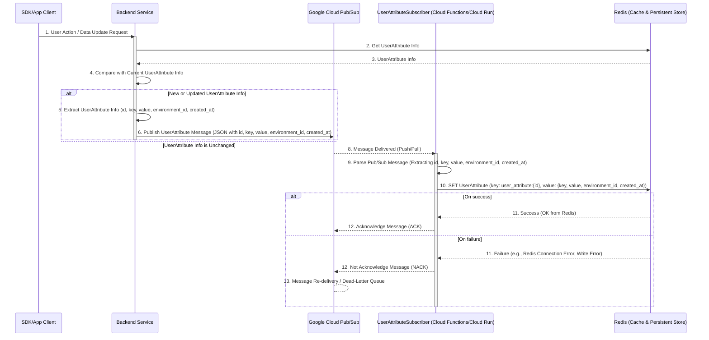

# Summary

Currently, when users configure rules on the Targeting tab in the console, they need to manually type custom attribute keys. This manual process can lead to typos and misconfigurations, potentially causing incorrect conditions when evaluating end-users.

Since these attributes are sent from the SDK to the server, we can automate this process by generating a list to display on the console. This will improve user experience and reduce configuration errors.

# Solution

We will implement an automated system to discover and manage user attributes:

1. Extract user attribute information from SDK requests
2. Compare with cached data in Redis
3. Publish only new attribute information using PubSub
4. Saving attributes to a Redis via PubSub
5. Provide an API for the console to retrieve the attribute list

## System Architecture



# Implementation Details

## Cache

- Create `UserAttributesCache` in the cache package
  - Key: environment_id
  - Value: []string (user_attribute_keys)

## PubSub

- Create new topic: `user-attribute-event`
- Create new subscription: `user-attribute-event-persister`
- Add topic and subscription definitions to YAML configuration
- Implement `UserAttributePersister` in the Processor

## API Server

- Implement attribute discovery in `getEvaluations` and `getEvaluation` requests
    - Extract UserAttribute from the User information contained in the following `getEvaluationsRequest` and `getEvaluationRequest`
```
type getEvaluationsRequest struct {
	Tag               string
	User              *userproto.User
	UserEvaluationsID string
	SourceID          eventproto.SourceId
}

type User struct {
	Id         string
	Data       map[string]string        // ← The key will be UserAttribute
	TaggedData map[string]*User_Data
	LastSeen   int64
	CreatedAt  int64
}

```
- It compares it with the list obtained from the `UserAttributeCache` and publishes only the new attributes to the user-attribute-event topic.

## API

Add new API to the Environment Package:

```protobuf
message ListUserAttributesRequest {
    string environment_id = 1;
}

message ListUserAttributesResponse {
    repeated string userAttributes = 1;
}
```

Note: Pagination is not implemented for this API.

# Important Considerations

-  Intentionally not implementing user attribute delete API
   - The deleted attribute may be needed again in the future, but there is currently no way to undo the deletion using the console.
   - However, the console takes into account the large number of user attributes by providing incremental search to improve usability.


# Testing

- The e2e test is performed in the following steps:
- Test flow:
  1. Send request via `GetEvaluation` or `GetEvaluations`
  2. Wait for processing
  3. Verify attributes via `ListUserAttributes` API

# Release Steps

1. Cache Implementation
   - Implement `UserAttributesCache`
   - Implement `UserAttributesCacher`

2.  PubSub Implementation
   - Implement `UserAttributePersister` (without Subscriber connection)

3. Implementing an API server and setting up topics and subscriptions in a Google Cloud project in the Dev environment
   - Add publishing logic
   - Configure PubSub in Dev environment
   - Connect UserAttributePersister
   - I run e2e tests and, if there are no problems, we release them to the production environment.

4. API Implementation
   - Implement `ListUserAttributes` endpoint
