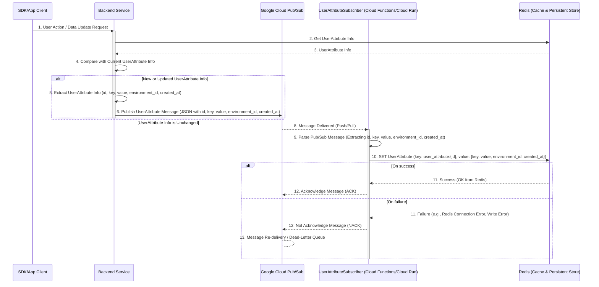
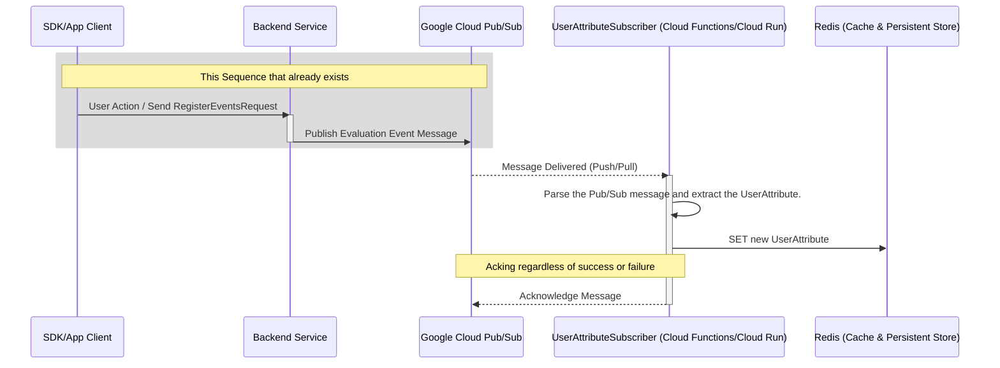
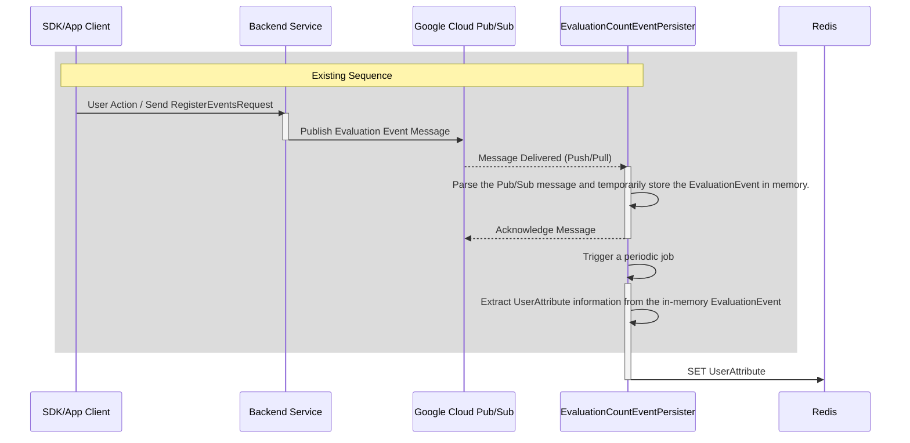

# Summary

Currently, when users configure rules on the Targeting tab in the console, they need to manually type custom attribute keys. This manual process can lead to typos and misconfigurations, potentially causing incorrect conditions when evaluating end-users.

Since these attributes are sent from the SDK to the server, we can automate this process by generating a list to display on the console. This will improve user experience and reduce configuration errors.

# Solution１ - Using the new PubSub topic for UserAttribute -

The UserData sent in the 'GetEvaluationsRequest' is compared with the UserAttributes stored in Redis, and only if new attributes are found, a PubSub topic for the newly created UserAttribute is published. The Subscriber stores the new UserAttribute in Redis.

1. Extract UserAttribute information from the GetEvaluationsRequest from the SDK
2. Compare with Redis UserAttribute cached data
3. Publish only new attribute information using PubSub
4. Save attributes to Redis with UserAttributeSubscriber.
5. Provide an API for the console to retrieve the attribute list

## Sequence

### Topic
- Since 'GetEvaluationsRequest' is always sent by SDK users, it is possible to accurately detect UserAttributes. However, since the request requires low latency, storage operations and the like must be processed in a separate thread as much as possible, which increases costs.
- Creating a topic for UserAttribute will increase your PubSub costs.

# Solution２ - Using existing PubSub topics that contain UserAttributes -

This solution leverages an existing PubSub topic by leveraging the UserAttribute included in the 'EvaluationEvent' sent by the 'RegisterEventsRequest'.

1. Add a new subscription for UserAttribute to the existing Evaluation Event topic.
2. Save attributes to Redis with UserAttributeSubscriber.
3. Provide an API for the console to retrieve the attribute list.


## Sequence

### Topic
- It leverages the existing PubSub topic for EvaluetionEvent, but will increase PubSub costs by 40-50%.
- Development costs are low by utilizing existing sequences.

# Solution3 - Using the existing EvaluationCountEventPersister -

This solution simply leverages the UserAttribute contained in the `EvaluationEvent` sent by the `RegisterEventsRequest` and adds a UserAttribute save operation to the existing data save sequence by leveraging the existing PubSub subscription.

1. Create `UserAttributesCache` for Redis.
2. In the `EvalEvtWriter` used by the `EventsPersister` which updates data related to `EvaluationEvent`, we will add a process to store the data in memory for a certain period of time and then store it using the `UserAttributesCache` when the time comes.
3. Provide an API for the console to retrieve the attribute list.


## Sequence

### Topic
- Existing PubSub subscriptions will be leveraged, so your PubSub costs will not increase.
- Development costs are low by utilizing existing sequences.

# Conclustion
I adopt **Solution3** because it will not increase development costs or PubSub costs.

# Solution3 Implementation Details

## Cache

- Create `UserAttributesCache` in the cache package
  - Key: string `{environment_id}:user_attrs:{attribute_key}`
  - Value: string (user attribute value)
  - Interface: Put and Get
  - The value is saved with `SADD` using a key that contains the UserAttributeKey. The expiration time of the UserAttributeKey is managed by `EXPIRE`, and the UserAttributeKey for each environment is obtained by `SCAN`.
      - ex):
        ```
          localhost:6379> SADD dev:attr:key1 "value1" "value2"  // store value1 and value2 in key1
          localhost:6379> EXPIRE dev:attr:key1 60               // set expiration time to 60 seconds
          localhost:6379> SCAN 0 MATCH "dev:attr:*" COUNT 100   // get the keys for the dev environment
        ```

## Processor
- UserAttributes are extracted from the `EvaluationEvent` obtained by the existing process `EvaluationCountEventPersister.Process()` and are stored in In-memory for a certain period of time (for example, 1 minute) to manage the last information obtained.
After a certain period of time has passed, the information stored in memory is cached using `UserAttributesCache`.

**Note:** This Solution is mainly for user suggestion, so there is no need to manage `UserAttributes` sensitively. Also, since the information about `UserAttributeKeys` changes infrequently, there is no need to save it every time in `EvaluationEvent`, which occurs in large numbers.

(The process of storing `EvaluationEvent` in In-memory is already present in `evaluationCountEventPersister.cacheLastUsedInfoPerEnv()`.)
## API

Add a new API to get UserAttributeKeys in the environment:

```protobuf
message ListUserAttributeKeysRequest {
    string environment_id = 1;
    int64 page_size = 2;
    string cursor = 3;
}

message ListUserAttributeKeysResponse {
    repeated string userAttributeKeys = 1;
    string cursor = 2;
}
```

# Testing

- The e2e test is performed in the following steps:
- Test flow:
  1. Send request via `RegisterEventsRequest`
  2. Wait for processing
  3. Verify attributes via `ListUserAttributes` API

# Release Steps

1. Implement Cache
   - Implement `UserAttributesCacher`.

2.  Implement Processor and API. and verify its operation through e2e test
   - Implement `UserAttributeCache` saving process in Processor
   - Implement `ListUserAttributes` API
   - Test e2e for Dev Env
